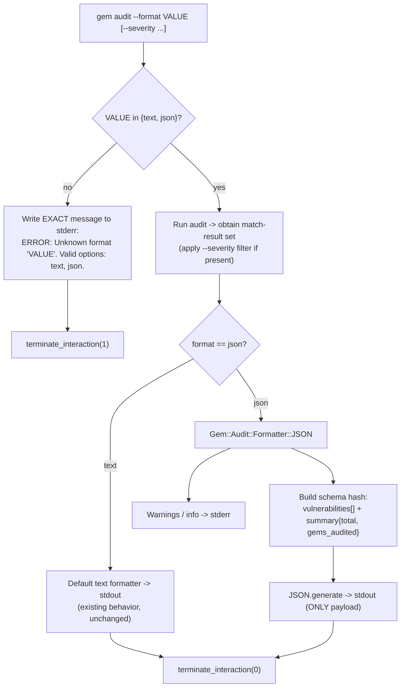

# Technical Specification

# 0. Agent Action Plan

## 0.1 Intent Clarification

### 0.1.1 Core Objective

Based on the provided requirements, the Blitzy platform understands that the objective is to **add a `--format` option to the `gem audit` command** so that a DevSecOps engineer can obtain vulnerability-audit results as a single, machine-readable JSON document on standard output. This eliminates fragile text-scraping when feeding audit results into SIEM platforms, security dashboards, and automated reporting pipelines.

The requirements, restated with technical precision, are:

- **Introduce a `--format` flag** on the `gem audit` command accepting two values — `text` (the default, which preserves the existing human-readable output unchanged) and `json`.
- **Emit one valid JSON document to stdout** when `--format json` is active. The document must be parseable by a strict JSON parser in a single pass.
- **Serialize the vulnerability match-result set** into a stable, documented schema with a top-level `vulnerabilities` array and a `summary` object.
- **Strictly separate streams in JSON mode** so that stdout carries *only* the JSON document, while all diagnostics (warnings, informational messages) are routed to standard error (stderr).
- **Enforce exit-code and validation semantics**: success returns exit code 0 (including the zero-vulnerability case); an unrecognized format value returns exit code 1 with an exact error message on stderr.
- **Document the JSON schema** in the command's help output (and the project's man-page equivalent) and cover the behavior with unit and integration tests.

The `gem audit` command is part of the RubyGems command framework, where every subcommand is a subclass of the abstract base `Gem::Command` and is dispatched by `Gem::CommandManager` [lib/rubygems/command.rb:L120-L149] [lib/rubygems/command_manager.rb:L39-L114].

> **Critical greenfield note.** The RubyGems Feature Catalog enumerates every documented `gem` subcommand (install, update, cert, signin, sources, dependency, contents, outdated, build, push, yank, cleanup, pristine, check, open, lock, exec, and others) and contains **no `gem audit` command** [Technical Specification §2.2 RubyGems Feature Catalog]. Direct inspection confirms there is no `audit_command.rb` among the 37 command files in `lib/rubygems/commands/`, and no advisory/CVE/formatter machinery anywhere under `lib/`. The vulnerability-audit capability therefore does not exist in this snapshot; it is being introduced by epic **STORY-001-02**, of which this story (the `--format json` capability) is one slice. The plan below distinguishes what *this* story creates from what its sibling stories provide.

### 0.1.2 Task Categorization

- **Primary task type:** ADD FEATURE — a new CLI output formatter on the `gem audit` command.
- **Secondary aspects:** Testing (unit + integration, ≥80% coverage) and Documentation (`gem audit --help` plus the man-page-equivalent help text).
- **Scope classification:** Cross-cutting *within the audit subsystem* (it touches option parsing, an output-formatter abstraction, and stdout/stderr routing) but **isolated from the rest of RubyGems** — it does not alter the vulnerability-matching engine, the advisory database, or any other `gem` subcommand.

### 0.1.3 Special Instructions and Constraints

The following acceptance criteria and behaviors are preserved **verbatim** from the user requirements because their exact wording (including precise byte-for-byte output strings) is contractual:

- **User Example — AC-1:** `gem audit --format json` writes a single valid JSON document to stdout that passes `JSON.parse`.
- **User Example — AC-2:** Given `rack 2.0.1` with 1 matching CVE advisory, the JSON has a top-level `vulnerabilities` array; each element has fields: `gem_name` (string), `installed_version` (string), `cve_id` (string), `severity` (string), `patched_versions` (array of strings).
- **User Example — AC-3:** Zero vulnerabilities → stdout is EXACTLY `{"vulnerabilities":[],"summary":{"total":0,"gems_audited":<count>}}`, exit code 0.
- **User Example — AC-4:** Warnings (e.g., staleness) and info go to STDERR only; stdout contains ONLY the JSON document.
- **User Example — AC-5:** Invalid format (e.g., `--format xml`) → stderr is EXACTLY `ERROR: Unknown format 'xml'. Valid options: text, json.`, exit code 1.
- **User Example — Edge cases:** advisory with null severity → `"severity": null` (present, not omitted); empty `patched_versions: []`; piping to `jq` must work (`gem audit --format json | jq`); `gem audit --format json --severity high` → only high/critical vulnerabilities, with the exit code reflecting the filtered result set.

Methodological directives carried from the Definition of Done:

- Preserve full backward compatibility: the default `text` output path must remain unchanged.
- Follow existing RubyGems command conventions; the new code mirrors the structure of existing command classes such as `lib/rubygems/commands/outdated_command.rb` [lib/rubygems/commands/outdated_command.rb:L1-L33].
- Pass lint/static analysis (RuboCop, target Ruby 3.2 [.rubocop.yml:L5]) and CI.

### 0.1.4 Technical Interpretation

These requirements translate to the following technical implementation strategy:

- To **offer format selection**, we will *modify* the `gem audit` command class by adding a `--format` option via `add_option` whose handler stores the chosen format into the options hash, defaulting to `text` [lib/rubygems/command.rb:L358].
- To **produce machine-readable output**, we will *create* a JSON formatter component that transforms the audit match-result set into the documented schema and writes it to stdout using the Ruby `json` standard library (`JSON.generate`).
- To **guarantee a clean stdout channel** (AC-4), we will *route* all non-vulnerability output through stderr when `json` mode is active, because RubyGems' `say` and informational `alert` helpers write to stdout by default while `alert_warning`/`alert_error` already write to stderr [lib/rubygems/user_interaction.rb:L328-L353].
- To **reject invalid formats deterministically** (AC-5), we will *validate* the `--format` value early and write the exact required message directly to the error stream followed by `terminate_interaction(1)`, rather than relying on the generic command-manager exception wrapper, whose formatting does not match the required string [lib/rubygems/command_manager.rb:L153-L162].
- To **satisfy the Definition of Done**, we will *create* unit and integration tests under `test/rubygems/` and *embed* the JSON schema documentation in the command's help methods (`description`/`arguments`), which serve as RubyGems' man-page equivalent.


## 0.2 Repository Scope Discovery

This section records the repository investigation that grounds the implementation plan. The repository is the official `ruby/rubygems` monorepo (RubyGems plus Bundler); RubyGems library version is `4.0.0.dev` [lib/rubygems.rb:L12] and the packaged updater is `3.8.0.dev` [rubygems-update.gemspec:L5]. No `.blitzyignore` files exist anywhere in the tree, so no paths are excluded from analysis.

### 0.2.1 Comprehensive File Analysis

The most consequential finding is that **the `gem audit` command and its supporting subsystem do not exist** in this snapshot. This was confirmed three ways:

- The RubyGems Feature Catalog documents the complete set of `gem` subcommands and lists no audit/advisory capability — the only "security" feature is X.509 gem signing and verification (`cert`, `signin`, `signout`), not vulnerability auditing [Technical Specification §2.2 RubyGems Feature Catalog].
- The command directory `lib/rubygems/commands/` contains 37 `*_command.rb` files (build, cert, check, cleanup, contents, dependency, environment, exec, fetch, generate_index, help, info, install, list, lock, mirror, open, outdated, owner, pristine, push, query, rdoc, rebuild, search, server, setup, signin, signout, sources, specification, stale, uninstall, unpack, update, which, yank) — **none named `audit`**.
- No advisory-, CVE-, or formatter-related implementation exists under `lib/rubygems/` (only incidental textual matches in unrelated files).

Consequently, the files relevant to this work fall into three groups, summarized here and detailed in §0.4:

- **Files this story creates or modifies** — the JSON formatter, the `--format` option wiring on the audit command, command registration, the manifest, and tests.
- **Prerequisite files owned by sibling stories** — the audit command shell, the match-result data structure (STORY-001-02-02), and the pluggable formatter abstraction with its default text formatter (STORY-001-02-03). These must exist at implementation time; if absent, minimal versions must be scaffolded.
- **Reference files** — existing command and test files whose structure and conventions the new code mirrors (no edits required).

The command-registration and packaging mechanics that any new command must satisfy were verified directly:

- `Gem::CommandManager` registers commands from an explicit `BUILTIN_COMMANDS` symbol array and lazily loads each by requiring `rubygems/commands/<name>_command` [lib/rubygems/command_manager.rb:L39-L114] [lib/rubygems/command_manager.rb:L230-L236]. Registering `gem audit` therefore requires adding `:audit` to that array **and** creating `lib/rubygems/commands/audit_command.rb`.
- Every library file is enumerated in `Manifest.txt` (e.g., `lib/rubygems/commands/outdated_command.rb` at line 383 [Manifest.txt:L383]); the build fails if the manifest is stale, enforced by `rake check_manifest` [Rakefile:L458-L460] and regenerated via `rake update_manifest` [Rakefile:L453-L454]. Every new file must be listed there.

### 0.2.2 Web Search Research Conducted

External research validated the design and confirmed the greenfield assessment:

- **Confirmation that `gem audit` is not an official RubyGems command.** The Ruby vulnerability-audit ecosystem lives in third-party tooling — `bundler-audit` and `ruby_audit` — both checking a project against the `rubysec/ruby-advisory-db` database. This corroborates the repository finding that the capability is new to RubyGems core.
- **Prior art for `--format text|json` via a formatter abstraction.** `bundler-audit` implements precisely this feature: a `--format` option (default `text`, with `json` and others) backed by pluggable *formatter* modules (one module per format) that each expose a `print_report(report, output)`-style method and self-register in a format registry. This is concrete prior art for the STORY-001-02-03 formatter abstraction this story plugs into.
- **Stream-separation best practice.** `bundler-audit` explicitly prints all error/diagnostic messages to stderr and is designed to be piped (`| jq`), confirming the convention behind AC-4: machine-readable output is the sole payload on stdout, and human diagnostics go to stderr.
- **Advisory data shape.** Advisory records in `ruby-advisory-db` are keyed by CVE/GHSA identifier and carry fields including `gem`, `cve`, `ghsa`, `title`, `url`, `patched_versions` (array), and CVSS/criticality. These ground the JSON schema fields (`gem_name`, `cve_id`, `severity`, `patched_versions`) and confirm that severity can be absent in source data — hence the AC requirement that `severity` be present as `null` rather than omitted.
- **JSON serialization.** Ruby's `json` standard library (`JSON.generate`) is the standard, requires no external dependency, and is already used inside this repository (see §0.2.3).

### 0.2.3 Existing Infrastructure Assessment

The implementation slots into established RubyGems conventions:

- **Command framework.** Commands subclass the abstract `Gem::Command`; the canonical shape is `super "name", "summary"` in `initialize`, option declarations via `add_option`, help via `description`/`arguments`/`usage`, and behavior in `execute` [lib/rubygems/command.rb:L120-L358]. `lib/rubygems/commands/outdated_command.rb` is a concise, representative template (frozen-string header, `require_relative` dependencies, mixin includes, `description` heredoc, `execute` using `say`) [lib/rubygems/commands/outdated_command.rb:L1-L33].
- **Output streams (drives AC-4).** In `Gem::UserInteraction`, `say` and informational `alert` write to the output stream (stdout), whereas `alert_warning` (prefix `"WARNING:  "`) and `alert_error` (prefix `"ERROR:  "`, two spaces) write to the error stream (stderr); `terminate_interaction(status)` ends the run with an exit code [lib/rubygems/user_interaction.rb:L328-L361]. Note that informational `alert` defaults to **stdout**, so JSON mode must suppress or redirect it.
- **Error/exit mechanics (drives AC-5).** The command manager's `run` rescues exceptions, prints `"While executing gem ... (<class>)"` via `alert_error`, and calls `terminate_interaction(1)` [lib/rubygems/command_manager.rb:L153-L162]. Because this wrapper uses a two-space `"ERROR:  "` prefix and a different message body, it cannot produce AC-5's exact single-space string — so the audit command must emit the AC-5 message directly. `Gem::CommandLineError < Gem::Exception < RuntimeError` is the idiomatic invalid-argument error [lib/rubygems/exceptions.rb:L9-L11].
- **Namespace convention.** `lib/rubygems/` uses a `<name>.rb` file paired with a `<name>/` directory for subsystems (e.g., `resolver.rb`+`resolver/`, `security.rb`+`security/`, `source.rb`+`source/`). The audit subsystem follows the same pattern under `lib/rubygems/audit.rb` + `lib/rubygems/audit/`. Reusable option groups (e.g., `version_option.rb`, `security_option.rb`) live at the `lib/rubygems/` root; the `--format` option, being audit-specific, is declared inline in the command rather than as a shared mixin.
- **Testing infrastructure.** Tests use minitest with the harness at `test/rubygems/helper.rb`; command tests are flat-named `test/rubygems/test_gem_commands_<name>_command.rb` (35 exist today). The established stdout/stderr isolation idiom is `use_ui @ui do @cmd.execute end` followed by assertions on `@ui.output` (captured stdout) and `@ui.error` (captured stderr) [test/rubygems/test_gem_commands_outdated_command.rb:L26-L33]. This is exactly the mechanism needed to assert AC-4 (only JSON on stdout) and AC-5 (exact message on stderr).
- **Documentation system.** RubyGems has **no `man/` directory**; subcommand documentation is the command class's `description`/`arguments` help text, surfaced by `gem help <cmd>` and `gem <cmd> --help`. (Bundler ships separate ronn man pages under `bundler/lib/bundler/man/`, built by `rake man:build` [Rakefile:L629] — these do not apply to `gem` subcommands.) The DoD's "documented in `--help` and man page" therefore maps to the audit command's help methods.
- **JSON availability.** The `json` standard library is already used in-repo via lazy `require "json"` [lib/rubygems/gemcutter_utilities/webauthn_poller.rb:L51] [lib/rubygems/s3_uri_signer.rb:L151], confirming no new dependency is required.


## 0.3 Implementation Design

### 0.3.1 Technical Approach

The feature is delivered as a thin, well-isolated vertical slice on top of the audit subsystem: a `--format` option that selects an output formatter, and a JSON formatter that serializes the match-result set into a documented schema on stdout while diagnostics are confined to stderr.

Primary objectives mapped to implementation approach:

- **Achieve format selection** by adding a `--format FORMAT` option to the audit command whose handler stores the value in the options hash, defaulting to `text`, so the existing human-readable path is the unchanged default [lib/rubygems/command.rb:L358].
- **Achieve machine-readable output** by creating `Gem::Audit::Formatter::JSON`, conforming to the formatter abstraction (STORY-001-02-03), which maps the match-result set (STORY-001-02-02) into the schema hash and writes `JSON.generate(hash)` to the output stream.
- **Achieve a clean stdout channel** by redirecting all informational and warning output to stderr when JSON mode is active, since `say`/informational `alert` otherwise write to stdout [lib/rubygems/user_interaction.rb:L328-L353].
- **Achieve deterministic invalid-format handling** by validating `--format` early and emitting the exact AC-5 message directly to stderr, then `terminate_interaction(1)`.

Logical implementation flow (sequence of construction, not a schedule):

- **First, establish format selection** in `lib/rubygems/commands/audit_command.rb` by declaring the `--format` option and validating its value against the allowed set `{text, json}` before any audit work begins.
- **Next, integrate serialization** by implementing the JSON formatter and wiring the command's `execute` to dispatch to the selected formatter, passing the match-result set and the output stream.
- **Next, enforce stream isolation** by ensuring that, in JSON mode, the only thing written to stdout is the formatter's JSON document and every diagnostic goes to stderr.
- **Finally, ensure quality** by adding unit and integration tests under `test/rubygems/`, embedding the schema in the command's help text, registering `:audit` in `BUILTIN_COMMANDS`, and updating `Manifest.txt`.

The control flow is shown below.



### 0.3.2 Component Impact Analysis

Direct modifications required:

- **`lib/rubygems/commands/audit_command.rb`** — add the `--format` option, the early validation path for AC-5, formatter selection in `execute`, and JSON-mode stderr routing; embed the JSON schema in `description`/`arguments`.
- **`Gem::Audit::Formatter::JSON` (new file `lib/rubygems/audit/formatter/json.rb`)** — the serializer that converts the match-result set into the schema and writes JSON to the output stream.

Indirect impacts and dependencies:

- **`lib/rubygems/command_manager.rb`** — add `:audit` to `BUILTIN_COMMANDS` so the command is dispatchable, unless the command shell story (STORY-001-02-01) already registered it [lib/rubygems/command_manager.rb:L39].
- **`Manifest.txt`** — list every new library file, or `rake check_manifest` fails [Rakefile:L458-L460].
- **Formatter abstraction (STORY-001-02-03)** — the JSON formatter must conform to its registration/`print_report` contract.
- **Match-result data structure (STORY-001-02-02)** — supplies `gem_name`, `installed_version`, `cve_id`, `severity`, and `patched_versions`; the serializer depends on these fields being available.
- **`--severity` flag (sibling story)** — when present, the result set is filtered before serialization and the exit code reflects the filtered set.

New components introduced:

- **`Gem::Audit::Formatter::JSON`** — this story's primary new component (the JSON formatter).
- **Prerequisite scaffolds (create only if absent at implementation time):** the audit command shell, `lib/rubygems/audit.rb` namespace/orchestration, the match-result structure, the formatter abstraction, and the default text formatter.

### 0.3.3 Command-Line Behavior Design

This is a CLI feature; its "interface" is the command's input options, output streams, and exit codes:

- **Input:** `gem audit --format <text|json> [--severity <level>]`. `--format` defaults to `text`.
- **Output (json mode):** exactly one JSON document on stdout; nothing else on stdout.
- **Diagnostics (json mode):** all warnings/info on stderr.
- **Exit codes:** `0` on success including zero vulnerabilities (AC-3); `1` on invalid `--format` (AC-5); with `--severity`, the exit code reflects the filtered results.
- **Composability:** stdout must be valid for `gem audit --format json | jq`.

The JSON output schema is:

```
{
  "vulnerabilities": [
    {
      "gem_name": "rack",
      "installed_version": "2.0.1",
      "cve_id": "CVE-XXXX-XXXX",
      "severity": "high",          // string, or null when unknown (key always present)
      "patched_versions": ["2.0.2", "2.1.4"]   // array of strings, may be empty []
    }
  ],
  "summary": { "total": 1, "gems_audited": 42 }
}
```

The empty-result document is byte-for-byte `{"vulnerabilities":[],"summary":{"total":0,"gems_audited":<count>}}` (AC-3).

### 0.3.4 User-Provided Examples Integration

- **AC-2 (`rack 2.0.1`, one CVE):** the formatter emits a single `vulnerabilities` element with `gem_name="rack"`, `installed_version="2.0.1"`, the advisory's `cve_id`, its `severity`, and `patched_versions` as an array — mapped directly from the match-result fields supplied by STORY-001-02-02.
- **AC-3 (empty):** the formatter produces the exact empty document and the command exits 0.
- **AC-5 (`--format xml`):** validation writes `ERROR: Unknown format 'xml'. Valid options: text, json.` to stderr and exits 1.
- **`| jq` pipe:** guaranteed by stdout containing only the JSON document.
- **`--format json --severity high`:** the result set is filtered to high/critical before serialization; both the JSON and the exit code reflect the filtered set.
- **Null severity / empty patched_versions:** the serializer always includes the `severity` key (value `null` when unknown) and always renders `patched_versions` as an array (`[]` when none).

### 0.3.5 Critical Implementation Details

- **Design pattern:** Strategy — the `--format` value selects a formatter object; `text` and `json` are interchangeable strategies behind the abstraction, making future formats additive. This mirrors the validated `bundler-audit` formatter-registry prior art.
- **Stream injection:** the formatter writes to an injected output stream (the command's stdout) rather than a hard-coded global, which is also what makes the `use_ui`/`@ui.output` test harness able to capture and assert the output [test/rubygems/test_gem_commands_outdated_command.rb:L26-L33].
- **AC-5 exactness:** the message must be emitted directly (single-space `ERROR:`), not via the generic exception wrapper which uses a two-space prefix and a different body [lib/rubygems/command_manager.rb:L153-L162].
- **Serialization:** use `require "json"` (lazy, stdlib) and `JSON.generate`; key order in the empty-document case must match AC-3 exactly (`vulnerabilities` then `summary`; `total` then `gems_audited`).
- **Nullability:** `severity` uses JSON `null` (Ruby `nil`) — never an empty string and never omitted.
- **Backward compatibility:** the `text` branch delegates to the existing default formatter behavior unchanged.
- **Edge handling:** an empty result still produces a well-formed document and exit 0; a non-array/absent match-result is treated as zero vulnerabilities.


## 0.4 File Transformation Mapping

### 0.4.1 File-by-File Execution Plan

Transformation modes: **CREATE** (new file), **UPDATE** (modify existing), **DELETE** (remove), **REFERENCE** (example to mirror; no edits). Because the audit subsystem is greenfield (§0.2.1), files are grouped by ownership: those this story owns, prerequisite scaffolds owned by sibling stories (created only if still absent at implementation time), and read-only references.

**Group A — Files this story (STORY-001-02-04) creates or modifies**

| Target File | Transformation | Source File/Reference | Purpose/Changes |
|-------------|----------------|-----------------------|-----------------|
| `lib/rubygems/audit/formatter/json.rb` | CREATE | `lib/rubygems/commands/outdated_command.rb` (REFERENCE for style); `bundler-audit` formats (conceptual REFERENCE) | JSON formatter `Gem::Audit::Formatter::JSON`: map the match-result set into `{vulnerabilities:[...],summary:{total,gems_audited}}` and write `JSON.generate(...)` to the output stream; `severity` nullable (key always present); `patched_versions` always an array. |
| `lib/rubygems/commands/audit_command.rb` | UPDATE (CREATE if the shell from STORY-001-02-01 is absent) | self; `lib/rubygems/commands/outdated_command.rb` (REFERENCE) | Add `--format FORMAT` option (default `text`) [lib/rubygems/command.rb:L358]; validate value against `{text,json}` early and emit the exact AC-5 message to stderr + `terminate_interaction(1)`; select and invoke the formatter in `execute`; route warnings/info to stderr in JSON mode; embed the JSON schema in `description`/`arguments` help. |
| `lib/rubygems/command_manager.rb` | UPDATE (skip if STORY-001-02-01 already registered it) | self | Add `:audit` to `BUILTIN_COMMANDS` so the command is dispatchable [lib/rubygems/command_manager.rb:L39-L114]. |
| `Manifest.txt` | UPDATE | self | Append every new library file (audit subsystem + formatter) so `rake check_manifest` passes [Rakefile:L458-L460]. |
| `test/rubygems/test_gem_commands_audit_command.rb` | UPDATE (CREATE if absent) | `test/rubygems/test_gem_commands_outdated_command.rb` (REFERENCE) | Acceptance/integration tests for AC-1 through AC-5 plus edge cases, using `use_ui @ui` and asserting on `@ui.output`/`@ui.error` [test/rubygems/test_gem_commands_outdated_command.rb:L26-L33]. |
| `test/rubygems/test_gem_audit_formatter_json.rb` | CREATE | `test/rubygems/test_gem_uri_formatter.rb` (REFERENCE for flat formatter-test naming) | Focused unit tests for the JSON formatter: schema correctness, null severity rendered as `null`, empty `patched_versions` as `[]`, empty-result exact document. |

**Group B — Prerequisite scaffolds (owned by sibling stories; create minimal only if still absent)**

| Target File | Transformation | Source File/Reference | Purpose/Changes |
|-------------|----------------|-----------------------|-----------------|
| `lib/rubygems/audit.rb` | CREATE if absent | `lib/rubygems/security.rb` (REFERENCE for namespace pattern) | `Gem::Audit` namespace and orchestration entry point (STORY-001-02-01). |
| `lib/rubygems/audit/report.rb` | CREATE if absent | — | Match-result data structure consumed by the serializer (STORY-001-02-02): exposes `gem_name`, `installed_version`, `cve_id`, `severity`, `patched_versions`, and an audited-gem count. |
| `lib/rubygems/audit/formatter.rb` | CREATE if absent | `bundler-audit` formatter registry (conceptual REFERENCE) | Formatter abstraction/registry selecting a formatter by name and defining the `print_report(report, io)` contract (STORY-001-02-03). |
| `lib/rubygems/audit/formatter/text.rb` | CREATE if absent | — | Default human-readable formatter (STORY-001-02-03); the unchanged default output path. |

**Group C — Reference files (read-only; mirror their conventions)**

| Target File | Transformation | Source File/Reference | Purpose/Changes |
|-------------|----------------|-----------------------|-----------------|
| `lib/rubygems/commands/outdated_command.rb` | REFERENCE | — | Canonical command structure to mirror (frozen-string header, `super`, `description`, `execute`) [lib/rubygems/commands/outdated_command.rb:L1-L33]. |
| `lib/rubygems/command.rb` | REFERENCE | — | Base API used by the command: `add_option`, `execute`, `description`, `arguments` [lib/rubygems/command.rb:L120-L358]. |
| `lib/rubygems/user_interaction.rb` | REFERENCE | — | Stream semantics for `say`/`alert`/`alert_warning`/`alert_error`/`terminate_interaction` [lib/rubygems/user_interaction.rb:L328-L361]. |
| `test/rubygems/helper.rb` | REFERENCE | — | `Gem::TestCase` and `Gem::MockGemUi` harness with `@ui.output`/`@ui.error` capture [test/rubygems/helper.rb:L45-L48]. |

### 0.4.2 New Files Detail

- **`lib/rubygems/audit/formatter/json.rb`** — Content type: source. Based on: RubyGems command/file conventions plus the `bundler-audit` JSON-format prior art. Key elements: a `Gem::Audit::Formatter::JSON` class/module that (a) lazily `require "json"`, (b) builds the schema hash from the match-result set, (c) writes `JSON.generate(hash)` to the injected output stream, and (d) registers itself with the formatter abstraction under the name `json`.
- **`test/rubygems/test_gem_audit_formatter_json.rb`** — Content type: test. Based on: existing flat formatter-test naming. Key cases: well-formed schema for one and many vulnerabilities; `severity: null` present when unknown; `patched_versions: []` when none; the exact empty-result document.

### 0.4.3 Files to Modify Detail

- **`lib/rubygems/commands/audit_command.rb`** — Add to `initialize` an `add_option("--format FORMAT", ...)` declaration defaulting to `text`. Add early validation that rejects unknown values with the exact AC-5 stderr message and `terminate_interaction(1)`. In `execute`, branch on the selected format: the `text` branch preserves existing behavior; the `json` branch invokes `Gem::Audit::Formatter::JSON` and ensures all diagnostics go to stderr. Extend `description`/`arguments` to document the `--format` values and the JSON schema.
- **`lib/rubygems/command_manager.rb`** — Insert `:audit` into the `BUILTIN_COMMANDS` array [lib/rubygems/command_manager.rb:L39]. No other logic changes; lazy loading already resolves `rubygems/commands/audit_command` by name [lib/rubygems/command_manager.rb:L230-L236].
- **`Manifest.txt`** — Add lines for `lib/rubygems/audit.rb`, `lib/rubygems/audit/report.rb`, `lib/rubygems/audit/formatter.rb`, `lib/rubygems/audit/formatter/text.rb`, `lib/rubygems/audit/formatter/json.rb`, `lib/rubygems/commands/audit_command.rb`, and the new test files, keeping the file sorted as the manifest requires [Rakefile:L453-L460].

### 0.4.4 Configuration and Documentation Updates

- **Configuration changes:** none. No build, CI, RuboCop, or packaging configuration requires modification beyond the `Manifest.txt` file listing.
- **Documentation updates:** the JSON schema and the `--format` option are documented inside the audit command's `description`/`arguments` help methods (RubyGems' man-page equivalent — there is no `man/` directory [Rakefile:L629]). No separate documentation file is created or edited.

### 0.4.5 Cross-File Dependencies

- **Registration coupling:** `command_manager.rb` (`BUILTIN_COMMANDS`) and the presence of `lib/rubygems/commands/audit_command.rb` must agree; both are required for `gem audit` to dispatch.
- **Manifest coupling:** every new library file must appear in `Manifest.txt`, enforced at build time [Rakefile:L458-L460].
- **Contract coupling:** `formatter/json.rb` depends on the formatter abstraction's registration/`print_report` contract (`formatter.rb`) and on the field names exposed by the match-result structure (`report.rb`).
- **No import rewrites:** new files use `require_relative` per convention; no existing imports elsewhere in the codebase need to change.


## 0.5 Scope Boundaries

### 0.5.1 Exhaustively In Scope

- **Source code (this story):**
  - `lib/rubygems/audit/formatter/json.rb` — the JSON formatter.
  - `lib/rubygems/commands/audit_command.rb` — the `--format` option, AC-5 validation, formatter selection, and JSON-mode stderr routing.
  - `lib/rubygems/command_manager.rb` — registration of `:audit` in `BUILTIN_COMMANDS` (if not already done by the command-shell story).
- **Prerequisite scaffolds (create minimal only if absent at implementation time):**
  - `lib/rubygems/audit.rb`, `lib/rubygems/audit/report.rb`, `lib/rubygems/audit/formatter.rb`, `lib/rubygems/audit/formatter/text.rb`.
- **Tests:**
  - `test/rubygems/test_gem_commands_audit_command.rb` — AC-1…AC-5 plus edge cases.
  - `test/rubygems/test_gem_audit_formatter_json.rb` — JSON formatter unit tests.
- **Packaging/manifest:**
  - `Manifest.txt` — listing of all new library files.
- **Documentation:**
  - The `--format` option and JSON schema documented inside the audit command's `description`/`arguments` help text.
- **Behavioral guarantees:**
  - stdout/stderr separation in JSON mode (AC-4); exact empty-result document and exit 0 (AC-3); exact invalid-format message and exit 1 (AC-5); `severity` nullable and `patched_versions` always an array; honoring `--severity` in the serialized output and exit code.

### 0.5.2 Explicitly Out of Scope

- **The vulnerability-matching engine and advisory comparison logic** — how installed gems are matched against advisories is the concern of the audit command/epic prerequisites (STORY-001-02-01/02), not this formatting story.
- **Advisory-database acquisition** — fetching, updating, caching, or vendoring the `ruby-advisory-db` dataset.
- **The `--severity` flag implementation itself** — owned by a sibling story; this story only *honors* an already-filtered result set and reflects it in the exit code.
- **The default text formatter's internals and the audit command's core behavior** — extended (a new branch and option) but not redefined; the existing `text` path remains byte-for-byte unchanged.
- **All other `gem` subcommands** — install, update, cert, signin, outdated, sources, and the rest [Technical Specification §2.2 RubyGems Feature Catalog] are untouched.
- **The Bundler tree** (`bundler/**`) — no changes; Bundler's own audit/man tooling is unrelated.
- **Additional output formats** — only `text` and `json` are in scope; no `xml`, `junit`, `sarif`, or `--output <file>` option (AC-5 enumerates exactly `text, json`).
- **Performance, networking, and exit-code semantics beyond this feature** — no caching or tuning of audit lookups; exit-code changes are limited to format-validation failure (1) and reflecting the filtered result set.
- **Unrelated refactoring, tooling, or future enhancements** not required by the acceptance criteria.


## 0.6 Dependency Inventory

### 0.6.1 Key Packages

The feature introduces **no new external dependencies**. The only library used by the new code is Ruby's `json`, which ships with the runtime and is already used inside this repository via lazy `require "json"` [lib/rubygems/gemcutter_utilities/webauthn_poller.rb:L51] [lib/rubygems/s3_uri_signer.rb:L151].

| Registry | Package Name | Version | Purpose |
|----------|--------------|---------|---------|
| Ruby stdlib | json | Bundled with Ruby (no separate pin) | Serialize audit results to JSON via `JSON.generate` |
| Ruby runtime | ruby | `>= 3.2.0` required [rubygems-update.gemspec:L39]; highest CI MRI `3.4.5` [.github/workflows/rubygems.yml:L30-L38] | Language runtime targeted by the implementation |

Existing development/build tooling is used as-is and is **not** modified by this story: the test suite runs on **minitest** (harness at `test/rubygems/helper.rb`), and static analysis runs on **RuboCop** with `TargetRubyVersion 3.2` and the `rubocop-performance` plugin [.rubocop.yml:L1-L5]. Their versions are governed by the repository's existing development dependency configuration and require no change.

### 0.6.2 Dependency Updates

- **New dependencies to add:** none.
- **Dependencies to update:** none.
- **Dependencies to remove:** none.
- **Import/reference updates:** none across the existing codebase. New files use `require_relative` per RubyGems convention, and the JSON formatter performs a local `require "json"`; no existing module's imports change. The only non-code "reference" update is the addition of the new files to `Manifest.txt` (§0.4.3), which is a packaging manifest rather than a dependency change.


## 0.7 Rules

No user-specified implementation rules were provided through the dedicated rules channel (the rules input was empty). Consequently, there are no externally mandated files, coding standards, or constraints beyond those already established by the repository and the user story itself.

The following task-specific requirements are emphasized within the user story and the Definition of Done, and are treated as binding for this implementation:

- **Preserve exact output contracts.** The empty-result document (AC-3) and the invalid-format message (AC-5) must match byte-for-byte, including spacing and key ordering.
- **Maintain backward compatibility.** The default `text` output path must remain unchanged; `--format` defaults to `text`.
- **Follow existing patterns.** New code mirrors RubyGems command conventions, using the `Gem::Command` base API and the structure of an existing command such as `lib/rubygems/commands/outdated_command.rb` [lib/rubygems/commands/outdated_command.rb:L1-L33].
- **Keep stdout clean in JSON mode.** Only the JSON document is written to stdout; all diagnostics go to stderr (AC-4).
- **Meet quality gates.** Pass RuboCop static analysis (target Ruby 3.2 [.rubocop.yml:L5]), achieve ≥80% unit-test coverage, and pass CI.
- **Document the schema.** The JSON schema is documented in the command's `--help`/man-page-equivalent help text.


## 0.8 Special Instructions

### 0.8.1 Special Execution Instructions

- **Greenfield handling.** Because the `gem audit` command and its match-result/formatter prerequisites do not exist in this snapshot (§0.2.1), the implementation must verify their presence at execution time. Where a prerequisite from a sibling story (STORY-001-02-01/02/03) is absent, a minimal conforming version must be scaffolded so the JSON feature is demonstrable end-to-end (`gem audit --format json | jq`).
- **Exact-string discipline.** AC-3 and AC-5 specify literal output; emit these strings directly rather than through helpers that add prefixes — the generic command-manager exception wrapper produces a two-space `"ERROR:  "` prefix and a different body and must not be used for AC-5 [lib/rubygems/command_manager.rb:L153-L162].
- **Manifest synchronization.** After creating files, update `Manifest.txt` (or run `rake update_manifest`) so `rake check_manifest` passes [Rakefile:L453-L460].
- **Testing approach.** Use the established `Gem::MockGemUi` + `use_ui` harness and assert separately on `@ui.output` (stdout) and `@ui.error` (stderr) to prove stream isolation [test/rubygems/test_gem_commands_outdated_command.rb:L26-L33]. Run tests non-interactively via the project's rake test task.

### 0.8.2 Constraints and Boundaries

- **Technical constraints:** target Ruby ≥ 3.2.0 [rubygems-update.gemspec:L39]; use only the `json` standard library (no new dependency); follow `require_relative` conventions for new files.
- **Process constraints:** do not modify the default text output, the matching engine, the advisory database, the `--severity` flag implementation, other `gem` subcommands, or the Bundler tree (§0.5.2).
- **Output constraints:** produce only `text` and `json` formats; in `json` mode, stdout must contain exactly one JSON document and nothing else.
- **Compatibility constraints:** existing behavior, exit codes, and help output for all other commands and for the audit `text` path remain unchanged.


## 0.9 Attachments

No attachments were provided with this request. The `review_attachments` input returned no files — there are no PDFs, images, or Figma frames associated with this story. All requirements were conveyed through the textual user story and its acceptance criteria, which are captured and preserved in §0.1.3.

- **Document/image attachments:** none.
- **Figma frames (name and URL):** none.


