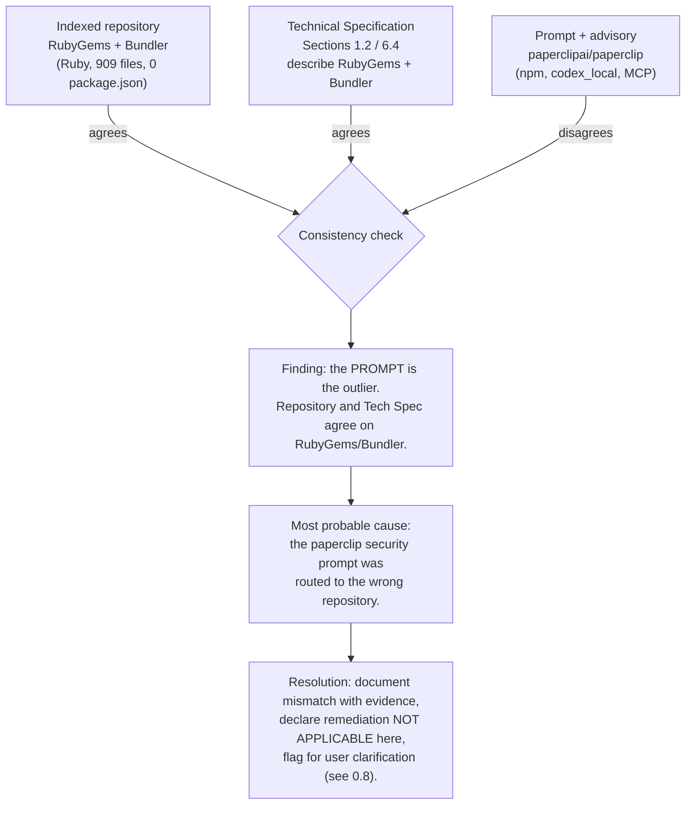
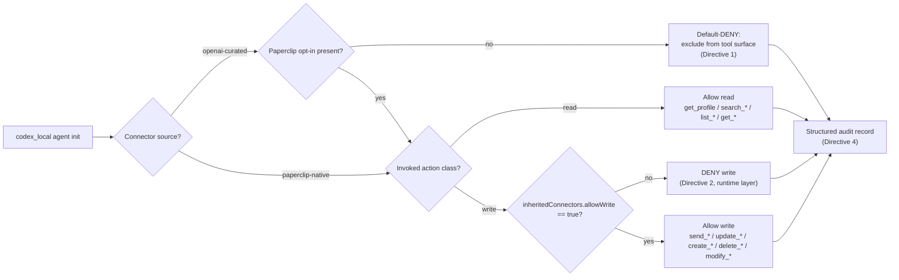

# Technical Specification

# 0. Agent Action Plan

## 0.1 Intent Clarification

> **CRITICAL RECONCILIATION NOTICE — READ FIRST.** The security remediation described in the prompt targets the project **`paperclipai/paperclip`** (an OpenAI Codex / agent-management platform, npm ecosystem), addressing advisory **GHSA-gqqj-85qm-8qhf**. The repository indexed for this task is the **RubyGems + Bundler mono-repo** (pure Ruby package manager; git remote `blitzy-public-samples/blitzy-rubygems`). These are different products in different ecosystems. An exhaustive whole-repository search found **zero** occurrences of every distinctive artifact named in the prompt. Consequently, the targeted vulnerability **does not exist in this repository**, and **no source files can or will be modified here**. This section faithfully captures the user's intent and the authoritative research; Section 0.3 documents the mismatch with hard evidence, and Section 0.8 flags it as the blocking item requiring user clarification. This notice is repeated where relevant so that no individual sub-section is read out of context.

This sub-section restates the security request in precise technical language, surfaces the implicit requirements and constraints embedded in the prompt, and translates the request into a concrete fix strategy for the correct target product.

### 0.1.1 Core Security Objective

Based on the security concern described, the Blitzy platform understands that the security vulnerability to resolve is a **trust-boundary / improper-access-control failure** in the `paperclipai/paperclip` agent-management platform, formally tracked as **advisory GHSA-gqqj-85qm-8qhf**. <cite index="5-1,5-2,5-3,5-4">A Paperclip-managed `codex_local` runtime was able to access and use a Gmail connector that the reporter had connected in the ChatGPT/OpenAI apps UI, even though Gmail had not been explicitly connected inside Paperclip or separately inside Codex; in that environment this enabled mailbox access and a real outbound email to be sent, and after manual intervention follow-up retraction messages were also sent, confirming repeated write/send capability — a trust-boundary failure amplified by dangerous-by-default runtime settings.</cite>

- **Vulnerability category:** Multiple, combined — (i) improper access control / broken trust boundary (silent connector inheritance), (ii) insecure default configuration (a "dangerous bypass" enabled by default), and (iii) missing audit/provenance for connector-mediated actions.
- **Severity level:** **High.** <cite index="2-1">The advisory was published to `paperclipai/paperclip` and is rated High with a score of 8.7 out of 10 on the Common Vulnerability Scoring System.</cite>

The prompt enumerates five mandatory remediation requirements. They are restated below with enhanced technical clarity (presented as discrete directives rather than a narrative to eliminate ambiguity):

- **Directive 1 — Block default inheritance of OpenAI-curated connectors.** Identify the connector-resolution path that reads `codex-home/plugins/cache/openai-curated/**/.app.json` (or equivalent OpenAI-curated connector state) during `codex_local` agent initialization, and modify the resolver so that OpenAI-curated connector state is **not** loaded into a `codex_local` runtime's available tool surface unless a Paperclip-side opt-in is present. *Success criterion:* a Gmail connector connected only in the ChatGPT/OpenAI apps UI results in a newly created `codex_local` agent that **must not** expose `mcp__codex_apps__gmail_*` tools.
- **Directive 2 — Require explicit opt-in for write actions.** Introduce a per-agent configuration field `inheritedConnectors.allowWrite: boolean` (default `false`) governing whether inherited connectors may perform write/send/update operations. Classify actions as **read-only** (`get_profile`, `search_*`, `list_*`, `get_*`) versus **write** (`send_email`, `send_draft`, `update_draft`, `create_*`, `delete_*`, `modify_*`). The write classification **must** be enforced at the runtime invocation layer, not only in the tool manifest. *Success criterion:* even when an inherited connector is permitted for reads, any write action must return an authorization error unless `allowWrite` is explicitly `true`.
- **Directive 3 — Flip the `dangerouslyBypassApprovalsAndSandbox` default to `false`.** Locate the agent-creation handler that currently applies `true` when the flag is omitted, and flip the default to `false`. The flag remains settable to `true` only when explicitly provided. *Success criterion:* a `codex_local` agent created via the server-side path with no flag in the request body must have approvals and sandbox enforcement active.
- **Directive 4 — Emit structured audit records.** For each invocation of a tool sourced from an inherited or Paperclip-configured connector, emit a structured log record containing: timestamp (ISO 8601), agent ID, connector source (`openai-curated` | `paperclip-native`), connector name, tool name, action classification (`read` | `write`), the opt-in state that authorized the call, and the invocation outcome (`allowed` | `denied` | `error`). Records are emitted before the action executes for allowed calls, and at denial time for denied calls. No action may bypass emission.
- **Directive 5 — Validate via PoC reproduction.** Execute the advisory's reproduction steps 1–4 against the patched build and confirm all assertions hold, while preserving the explicitly-configured opt-in path as a positive-path regression. Publish the patched version as the next release above `2026.403.0` and update the GitHub advisory with the fixed version range.

**Implicit security needs surfaced from the request:**

- **Backward compatibility / zero functional regression.** The fix must be additive — intentionally-configured connector flows and explicitly-set bypass flags must continue to work unchanged.
- **Least privilege by default.** The remediation re-establishes a default-deny posture (no inheritance, no write, no bypass) while allowing explicit, auditable opt-in.
- **Auditability and non-repudiation.** Every connector-mediated action becomes traceable, which is an implicit compliance and incident-response requirement.
- **Coordinated disclosure hygiene.** Publishing a fixed release and updating the advisory's fixed-version range is required to close the supply-chain exposure for downstream consumers.

### 0.1.2 Special Instructions and Constraints

The prompt embeds explicit directives and system boundaries that constrain the remediation. These are captured verbatim in intent and preserved exactly where they take the form of examples.

- **Change scope preference:** **Minimal / targeted.** Apply the smallest change that completely closes the vulnerability; do not refactor unrelated code.
- **Backward compatibility:** **Required.** API changes are **additive only** — no existing field on the agent-creation API may be removed or renamed.
- **Preserve explicit behavior:** Agents where callers explicitly pass `dangerouslyBypassApprovalsAndSandbox: true` must continue to behave exactly as before; only the **default** changes.

**System boundaries (must-not constraints), as specified:**

- Must **not** modify the Codex protocol itself, upstream OpenAI SDK surfaces, or connector definitions sourced from `openai-curated` cache files (read-through only; no mutation of cached manifests).
- Must **not** alter connectors intentionally configured inside Paperclip (`paperclip-native` source) beyond adding audit emission.
- Must **not** remove or rename existing fields on the agent-creation API (additive-only).
- Must **preserve** existing behavior for agents that explicitly pass `dangerouslyBypassApprovalsAndSandbox: true`.

**Preserved user examples (reproduced exactly as provided):**

- *User Example (observed runtime calls):* `mcp__codex_apps__gmail_get_profile`, `mcp__codex_apps__gmail_search_emails`
- *User Example (curated-connector cache path):* `codex-home/plugins/cache/openai-curated/**/.app.json`
- *User Example (opt-in field):* `inheritedConnectors.allowWrite: boolean` (default `false`)
- *User Example (release directive):* publish the patched version as the next release above `2026.403.0`

**Web search requirements (as directed by the security-fix flavor):** consult authoritative CVE/advisory databases (GitHub Advisory Database, GitLab advisory mirror), the package maintainer's security advisory, and the relevant CWE/CVSS references. This research has been completed and is reported in Section 0.2.

**User understanding level:** Explicit, advisory-grade. The user supplied a named advisory (GHSA-gqqj-85qm-8qhf), a detailed proof-of-concept, and per-directive success and validation criteria.

### 0.1.3 Technical Interpretation

This security vulnerability translates to the following technical fix strategy **in the correct target product** (`paperclipai/paperclip`). The mapping uses the form "To resolve [vulnerability], we will [action] [component]":

- To resolve the **silent connector inheritance**, we will modify the connector-resolution path so that `openai-curated` connector state is excluded from a `codex_local` runtime's tool registry unless a Paperclip-side opt-in is present (default-deny inheritance; read-through only on cached manifests).
- To resolve the **unbounded write capability**, we will add an additive `inheritedConnectors.allowWrite` boolean (default `false`), classify each tool as read or write, and enforce the write gate at the runtime invocation layer.
- To resolve the **insecure default**, we will flip the server-side agent-creation default of `dangerouslyBypassApprovalsAndSandbox` to `false`, while preserving explicit `true`.
- To resolve the **missing provenance**, we will emit one structured audit record per connector-mediated invocation (timestamp, agent ID, connector source, connector name, tool name, classification, opt-in state, outcome).
- To **validate**, we will reproduce advisory PoC steps 1–4 on the patched build, add a positive-path opt-in regression, and publish the fixed release above `2026.403.0`.

**Interpretation of applicability to the indexed repository:** Because the indexed repository is RubyGems/Bundler and contains none of the components named above, this technical fix strategy is **documented but not executable here**. The intent is fully and faithfully captured for the correct target product; the implementation pathway in this repository is **NOT APPLICABLE**, and the project mismatch (Section 0.3) is the single blocking item requiring user clarification before any code change could proceed.


## 0.2 Vulnerability Research and Analysis

This sub-section reports the authoritative research conducted on advisory GHSA-gqqj-85qm-8qhf, classifies the weakness, and records the external sources consulted. All findings pertain to the correct target product, `paperclipai/paperclip`; their applicability to the indexed RubyGems/Bundler repository is addressed in Sections 0.3 and 0.4.

### 0.2.1 Initial Assessment

The prompt supplies a single, explicit advisory identifier with a detailed proof-of-concept. The security-relevant information extracted is summarized below:

| Attribute | Value |
|-----------|-------|
| Advisory identifier | GHSA-gqqj-85qm-8qhf |
| CVE number(s) mentioned | None (GitHub Security Advisory ID only) |
| Vulnerability name | "Paperclip: codex_local inherited ChatGPT/OpenAI-connected Gmail and was able to send real email" |
| Affected package | `paperclipai` (npm ecosystem) |
| Affected component | `codex_local` runtime connector inheritance; server-side agent-creation defaults |
| Symptoms described | Unintended Gmail mailbox access and real outbound email send from a `codex_local` agent |
| Security advisories referenced | GitHub Advisory Database; package maintainer's GitHub security advisory; GitLab advisory mirror |

<cite index="5-1">The advisory describes that a Paperclip-managed `codex_local` runtime was able to access and use a Gmail connector that the reporter had connected in the ChatGPT/OpenAI apps UI, even though Gmail had not been explicitly connected inside Paperclip or separately inside Codex.</cite> <cite index="5-2,5-3">In the reporter's environment this enabled mailbox access and a real outbound email from their Gmail account, and after manual intervention to stop the workflow, follow-up retraction messages were also sent — confirming repeated outward write/send capability.</cite> <cite index="5-5,5-9">The reporter observed successful runtime calls including `mcp__codex_apps__gmail_get_profile` and `mcp__codex_apps__gmail_search_emails`.</cite>

### 0.2.2 Vulnerability Classification

- **Vulnerability type:** Improper Access Control (broken trust boundary) compounded by insecure default configuration and missing audit provenance.
- **Weakness:** <cite index="1-2">CWE-284: Improper Access Control.</cite>
- **Root cause:** <cite index="5-4">The advisory characterizes the issue as a trust-boundary failure between Paperclip-managed Codex execution and inherited OpenAI app connectors, amplified by dangerous-by-default runtime settings.</cite> In technical terms, the connector-resolution path admits `openai-curated` connector state into the `codex_local` tool surface without a Paperclip-side opt-in, and the server-side agent-creation path applies `dangerouslyBypassApprovalsAndSandbox = true` by default when the flag is omitted, with no per-action capability classification or audit at the runtime invocation layer.
- **Severity / score:** <cite index="2-1">High — 8.7 on the CVSS scale.</cite>
- **CVSS v3.1 vector and base-metric interpretation:**

| Base metric | Value | Interpretation |
|-------------|-------|----------------|
| Attack Vector (AV) | Network (N) | <cite index="2-2">Attack vector is Network.</cite> |
| Attack Complexity (AC) | Low (L) | <cite index="2-2">Attack complexity is Low.</cite> |
| Privileges Required (PR) | Low (L) | <cite index="2-2">Privileges required is Low.</cite> |
| User Interaction (UI) | Required (R) | <cite index="2-2">User interaction is Required.</cite> |
| Scope (S) | Changed (C) | <cite index="2-2">Scope is Changed.</cite> |
| Confidentiality (C) | High (H) | <cite index="2-2">Confidentiality impact is High.</cite> |
| Integrity (I) | High (H) | <cite index="2-2">Integrity impact is High.</cite> |
| Availability (A) | None (N) | <cite index="2-2">Availability impact is None.</cite> |

<cite index="1-2">The full CVSS v3.1 vector is `AV:N/AC:L/PR:L/UI:R/S:C/C:H/I:H/A:N`.</cite>

- **Attack vector summary:** Network-reachable, low-complexity, requiring only low privileges and a unit of user interaction; the scope change reflects that the impact crosses a trust boundary into an external system (the user's connected Gmail account), with high confidentiality and integrity impact (mailbox read plus unauthorized outbound send) and no direct availability impact.
- **Affected versions:** <cite index="5-1">The advisory applies to `paperclipai` (npm) version 2026.403.0.</cite> <cite index="1-1">It states that all versions up to 2026.403.0 are affected and that, at the time of indexing, there is no solution available yet.</cite>

### 0.2.3 Web Search Research Conducted

The following authoritative sources were reviewed during research. (Full URLs are consolidated in Section 0.9 References.)

- **GitHub Advisory Database — GHSA-gqqj-85qm-8qhf.** <cite index="2-1">The record shows the advisory was published to `paperclipai/paperclip` by `cryppadotta` on Apr 16, 2026, reviewed and added to the GitHub Advisory Database the same day, with a High severity rating of 8.7.</cite>
- **Package maintainer's GitHub security advisory (`github.com/paperclipai/paperclip/security/advisories/...`).** Source of the proof-of-concept narrative, the observed `mcp__codex_apps__gmail_*` runtime calls, and the affected version (`2026.403.0`).
- **GitLab advisory mirror (`advisories.gitlab.com/npm/paperclipai/...`).** Source confirming the CVSS v3.1 vector and the CWE-284 classification, and the "no solution available yet" status at index time.
- **Target product identification.** <cite index="3-1">The `paperclipai/paperclip` repository describes itself as "The open-source app everyone uses to manage agents at work."</cite> This — together with sibling advisories on the same project referencing React/TypeScript UI components, server API endpoints, npm dependencies, and PostgreSQL migrations — confirms that the target is a TypeScript/Node.js + PostgreSQL agent-management platform in the **npm** ecosystem, a fundamentally different stack from the Ruby repository under analysis.

**Recommended mitigation strategy (synthesized from the advisory and the prompt's directives):** default-deny inheritance of `openai-curated` connectors into `codex_local`; an additive `inheritedConnectors.allowWrite` opt-in with runtime-layer write gating; flip the `dangerouslyBypassApprovalsAndSandbox` server-side default to `false`; emit structured audit records per connector-mediated invocation; and validate by reproducing the advisory PoC.

**Patched-version status (alternatives considered):** At index time the advisory reported no fixed version. The prompt's authoritative instruction is to publish the patched build as the **next release above `2026.403.0`** and to update the advisory's fixed-version range. The upstream project has since shipped subsequent calendar-versioned releases; however, this plan does not assert which specific release closes this particular advisory, because the advisory itself indicated no fix at the time of indexing. The actionable target therefore remains the prompt's directive: a release above `2026.403.0`.


## 0.3 Security Scope Analysis and Repository Reconciliation

This sub-section documents the exhaustive repository scope analysis. Its purpose is to determine, with hard evidence, which files in the indexed repository are affected by GHSA-gqqj-85qm-8qhf. The investigation concludes that **none are**, because the indexed repository is a different product from the one the advisory targets. This finding is the pivot point of the entire Agent Action Plan.

### 0.3.1 Repository Identity Verification

The repository indexed for this task was verified directly from its working tree and version-control metadata:

| Property | Verified Value |
|----------|----------------|
| Working directory | `/tmp/blitzy/blitzy-rubygems/master_fc613b` |
| Git remote (origin) | `github.com/blitzy-public-samples/blitzy-rubygems.git` |
| HEAD commit | `e8544b2d6` — "Merge pull request #9033 from ruby/enable-force-activate" |
| Project identity | RubyGems + Bundler mono-repo (the Ruby package manager and its dependency manager) |
| Language composition | 909 Ruby files; 0 JavaScript/TypeScript files; 0 `package.json`; 2 incidental Rust files |
| Package metadata | `rubygems-update.gemspec` — name `rubygems-update`, version `3.8.0.dev` (semantic versioning), `required_ruby_version >= 3.2.0` |
| Vulnerability reporting channel | `SECURITY.md` directs reports to `security@rubygems.org` and HackerOne (`hackerone.com/rubygems`) |

Corroboration from the Technical Specification itself: Section 1.2 (System Overview) and Section 6.4 (Security Architecture) describe a **pure-Ruby, client-side package manager** requiring Ruby `>= 3.2.0`, whose documented security model covers gem signing, API-key/MFA authentication to RubyGems.org, AWS SigV4 request signing, TLS transport hardening, and safe deserialization (SafeMarshal / SafeYAML). Section 6.4 states explicitly that authorization decisions occur at remote services rather than within the codebase — there is no server-side agent-creation handler, connector resolver, tool registry, `codex_local` runtime, or MCP tooling anywhere in the project.

By contrast, the advisory targets `paperclipai`, an **npm-ecosystem** TypeScript/Node.js + PostgreSQL platform that uses calendar versioning (`2026.403.0`). The version scheme, ecosystem, language, and disclosure channel are all mutually inconsistent with the indexed repository.

### 0.3.2 Exhaustive Affected-Component Discovery

A whole-repository search was performed for every distinctive artifact named in the prompt's five directives. The search covered all tracked files (excluding only the `.git` directory). The representative command form was:

```bash
for kw in codex_local codex-home dangerouslyBypassApprovalsAndSandbox \
          openai-curated mcp__codex_apps inheritedConnectors allowWrite \
          GHSA-gqqj-85qm-8qhf; do
  echo "$kw -> $(grep -rli "$kw" . | grep -v '/.git/' | wc -l) file(s)"
done
```

The results establish a complete absence of every vulnerability artifact:

| Searched artifact (from directive) | Files matched | Interpretation |
|------------------------------------|:-------------:|----------------|
| `codex_local` | 0 | No `codex_local` runtime concept exists |
| `codex-home` | 0 | No curated-connector cache root exists |
| `dangerouslyBypassApprovalsAndSandbox` | 0 | No such flag / default exists (Directive 3 has no target) |
| `openai-curated` | 0 | No OpenAI-curated connector state is read anywhere (Directive 1 has no target) |
| `mcp__codex_apps` | 0 | No MCP tool surface exists (no `gmail_*` tools to gate) |
| `inheritedConnectors` | 0 | No connector-inheritance config exists (Directive 2 has no target) |
| `allowWrite` | 0 | No write opt-in field exists |
| `GHSA-gqqj-85qm-8qhf` | 0 | The advisory is not referenced anywhere |

**Incidental (coincidental) keyword hits — verified unrelated:**

| Keyword | Hits | Where, and why it is unrelated |
|---------|:----:|--------------------------------|
| `paperclip` | 1 | Third-party gem **name** ("Paperclip-Autosizer") inside a Bundler VCR test cassette: `bundler/spec/support/artifice/vcr_cassettes/realworld/index.rubygems.org/versions/GET/response` |
| `connector` | 1 | Third-party gem **name** ("EyeEmConnector") in the same VCR cassette |
| `app.json` | 1 | Appears only as a gem-name fragment in the same VCR cassette |
| `gmail` | 4 | Maintainer/author **email addresses** in `doc/MAINTAINERS.txt`, `rubygems-update.gemspec` (`s.email`), and `lib/rubygems.rb` author comments, plus gem names in the VCR cassette |

A semantic code search for "connector resolution path that loads OpenAI curated app connectors into agent runtime tool registry" returned **no results**, independently confirming the keyword findings. No `.blitzyignore` files exist anywhere in the repository, so no files were excluded from this analysis.

**Per-directive mapping result:** every one of the five directives requires a component that does not exist here.

| Directive | Required component | Present in repo? |
|-----------|--------------------|:----------------:|
| 1 — Block curated-connector inheritance | Connector-resolution path reading `openai-curated/**/.app.json` | No |
| 2 — Write opt-in + read/write gate | Per-agent connector config + MCP invocation layer | No |
| 3 — Flip insecure default | Server-side agent-creation handler with the bypass flag | No |
| 4 — Structured audit records | Connector/tool invocation pipeline to instrument | No |
| 5 — PoC reproduction | `codex_local` runtime, `mcp__codex_apps__gmail_*` tools, agent record store | No |

### 0.3.3 Reconciliation Finding

Three independent signals were cross-checked to determine the source of the discrepancy:



- **Repository identity** resolves to RubyGems/Bundler (Section 0.3.1).
- **Technical Specification** Sections 1.2 and 6.4 describe RubyGems/Bundler.
- **Prompt and advisory** describe `paperclipai/paperclip`.

Because two of three signals agree and the prompt is the lone outlier, the most probable real-world cause is that the `paperclip` security-remediation prompt was routed to the wrong repository. **Root-cause determination for this repository:** the vulnerability described by GHSA-gqqj-85qm-8qhf has **no root cause within this codebase**, because the vulnerable subsystem (Codex connector inheritance) is not implemented here.

In keeping with evidence-based reporting standards, the Agent Action Plan does not invent `paperclip`/Codex files to satisfy the directives. The remediation is therefore declared **NOT APPLICABLE** to the indexed repository (see Sections 0.4.3 and 0.5.1), and the project mismatch is escalated as the blocking item requiring user clarification (Section 0.8). A note for completeness: the RubyGems security model in Tech Spec Section 6.4 happens to articulate "Secure by Default" and "Explicit Security Opt-In" principles that *thematically* echo the advisory's "flip the unsafe default" and "require opt-in" remedies — but this is a coincidental philosophy overlap concerning gem package management, **not** an implementation target for the connector vulnerability, and it is explicitly out of scope (Section 0.7).


## 0.4 Security Fix Design and Version Compatibility

This sub-section documents the minimal fix design for the correct target product, the version-compatibility considerations, and the explicit determination that the design is not applicable to the indexed repository. The design is presented so that the user can act on it once the repository is corrected; it is **not** implemented here.

### 0.4.1 Reference Fix Strategy (Correct Target Product)

The remediation follows the security-fix principle of the **smallest change that completely closes the vulnerability**, applied as an additive, backward-compatible set of changes within `paperclipai/paperclip`. The four controls map one-to-one to Directives 1–4, and Directive 5 validates them:



- **Directive 1 — Default-deny inheritance.** Modify the connector-resolution path so that connector state cached under `codex-home/plugins/cache/openai-curated/**/.app.json` is excluded from the `codex_local` tool registry unless a Paperclip-side opt-in exists. Cached manifests are read-through only and never mutated (system-boundary constraint).
- **Directive 2 — Capability gate.** Add the additive per-agent field `inheritedConnectors.allowWrite: boolean` (default `false`); classify each tool as read or write; enforce write denial at the runtime invocation layer. Conceptually:

```typescript
// default-deny: write tools require an explicit, per-agent opt-in
if (classify(tool) === "write" && agent.inheritedConnectors?.allowWrite !== true) {
  return deny("missing inheritedConnectors.allowWrite opt-in");
}
```

- **Directive 3 — Insecure default flip.** In the server-side agent-creation handler, default `dangerouslyBypassApprovalsAndSandbox` to `false` when the field is omitted; preserve explicit `true` exactly. This is a default change only — no field is removed or renamed (additive-only API constraint).
- **Directive 4 — Audit emission.** Emit one structured record per connector-mediated invocation, before allowed actions execute and at denial time for denied actions, containing the timestamp (ISO 8601), agent ID, connector source, connector name, tool name, action classification, opt-in state, and outcome.
- **Directive 5 — Validation.** Reproduce advisory PoC steps 1–4 on the patched build and add a positive-path regression confirming that an agent with `allowWrite: true` for Gmail can still send (the fix is a targeted gate, not a blanket disablement). Validation details are in Section 0.6.

**Security improvement rationale:** the combination re-establishes least privilege (default-deny inheritance and writes), eliminates the insecure default, and adds non-repudiation through auditing — directly addressing the CWE-284 improper-access-control root cause without altering the Codex protocol or curated cache manifests.

### 0.4.2 Version Compatibility and Patched-Version Target

| Dimension | Target Product (`paperclipai`) | Indexed Repository (RubyGems/Bundler) |
|-----------|--------------------------------|---------------------------------------|
| Ecosystem | npm | RubyGems (Ruby) |
| Language/runtime | TypeScript / Node.js | Ruby `>= 3.2.0` |
| Versioning scheme | Calendar (`2026.403.0`) | Semantic (`3.8.0.dev`) |
| Affected version range | All versions up to and including `2026.403.0` | Not applicable (package not present) |
| Patched-version target | Next release above `2026.403.0`; update advisory fixed range | Not applicable |
| Breaking changes in upgrade path | None — changes are additive (new opt-in field; default flip with explicit override preserved) | Not applicable |

Because the remediation is additive (a new optional field and a changed default that remains overridable), no breaking change is introduced for consumers who explicitly configure their agents. No alternative/replacement package is required — the fix is internal to `paperclipai`, not a dependency swap. For the indexed Ruby repository, there is no version action of any kind: the `paperclipai` package is neither a direct nor a transitive dependency (Section 0.5.2).

### 0.4.3 Applicability Determination for This Repository

Applying the minimal-fix principle to the indexed RubyGems/Bundler repository yields **zero changes**, for the following evidence-based reasons:

- Each directive targets a component proven absent by the exhaustive search in Section 0.3.2 (every distinctive keyword matched zero files).
- The Technical Specification (Sections 1.2, 6.4) independently confirms there is no agent-creation handler, connector resolver, MCP tool surface, or `codex_local` runtime in this codebase.
- Modifying any Ruby file to "simulate" the fix would constitute fabrication and a scope violation, contradicting both the minimal-change directive and evidence-based reporting standards.

**Determination:** the security fix design is sound and ready for the correct target product, but it is **NOT APPLICABLE** to the indexed repository. No Ruby source file will be created, updated, or deleted. The actionable next step is for the user to confirm the intended repository (see Section 0.8), after which this design can be executed against `paperclipai/paperclip`.


## 0.5 File Transformation Mapping and Dependency Inventory

This sub-section provides the file-by-file transformation map and the dependency inventory. For the indexed repository both are intentionally empty — and that emptiness is a *concluded* result of exhaustive discovery (Section 0.3.2), not a deferral. Nothing is left "pending" or "to be discovered."

### 0.5.1 File Transformation Mapping

**Transformation map for the indexed RubyGems/Bundler repository: NOT APPLICABLE (empty).**

| Target File | Transformation | Source File/Reference | Security Changes |
|-------------|----------------|-----------------------|------------------|
| — (none) | — | — | No file in this repository corresponds to any of the five directives; whole-repo search returned zero matches for every distinctive artifact (Section 0.3.2). Per evidence-based standards, no Ruby file will be created, updated, or deleted. |

Rationale: modifying any file here would be fabrication and a scope violation. There are likewise **no REFERENCE-mode files** in this repository — the only external references are the advisory URLs (Section 0.9), which are citations rather than in-repository pattern files.

**Illustrative target-project mapping (transparency only — these paths do NOT exist in this repository and will NOT be created here).** The table below shows where the remediation would land in the correct `paperclipai/paperclip` codebase, to make the plan actionable once the repository is corrected. Every row is explicitly non-applicable to the indexed repository.

| Target File (illustrative, in `paperclipai/paperclip`) | Transformation | Security Changes |
|--------------------------------------------------------|----------------|------------------|
| Connector-resolution module | UPDATE | Default-deny inheritance of `openai-curated` connector state into `codex_local`; read-through only on cached `.app.json` (Directive 1) |
| Agent-creation server route/handler | UPDATE | Flip `dangerouslyBypassApprovalsAndSandbox` default to `false`; preserve explicit `true` (Directive 3) |
| Per-agent configuration schema | UPDATE | Add additive `inheritedConnectors.allowWrite: boolean` (default `false`) (Directive 2) |
| MCP / connector runtime invocation layer | UPDATE | Read vs write tool classification; enforce write gate at invocation time (Directive 2) |
| Connector audit logger | CREATE | Structured per-invocation audit records (Directive 4) |
| Security regression test suite | CREATE | Reproduce advisory PoC steps 1–4 + positive-path opt-in regression (Directive 5) |
| Release / advisory metadata | UPDATE | Publish next release above `2026.403.0`; update advisory fixed-version range (Directive 5) |

### 0.5.2 Dependency Inventory

**Security patches and updates: NONE for this repository.**

| Registry | Package Name | Current | Patched To | CVE/Advisory | Severity |
|----------|--------------|---------|------------|--------------|----------|
| npm | `paperclipai` | n/a (not a dependency here) | n/a | GHSA-gqqj-85qm-8qhf | High (CVSS 8.7) |

The affected package `paperclipai` belongs to the **npm** ecosystem and is **neither a direct nor a transitive dependency** of RubyGems or Bundler. The indexed repository contains zero `package.json` files and is a pure-Ruby project (`required_ruby_version >= 3.2.0`; `rubygems-update` `3.8.0.dev`). Accordingly:

- **Direct dependencies requiring updates:** none.
- **Transitive dependencies affected:** none.
- **Peer/development dependencies to verify:** none related to this advisory.
- **Import/reference updates:** none — there are no imports of the affected package to rewrite.

The remediation for GHSA-gqqj-85qm-8qhf is an internal code change in `paperclipai` (default flip, opt-in gate, audit emission), **not** a dependency-version bump; even in the correct repository, this advisory is resolved by shipping a fixed `paperclipai` release rather than by altering a third-party dependency. The RubyGems/Bundler dependency posture is therefore **unaffected**, and no gem version changes are warranted.


## 0.6 Impact Analysis and Testing Strategy

This sub-section defines the security testing and verification strategy for the remediation and assesses its impact. The strategy is specified for the correct target product; its applicability to the indexed repository is none, because no code change is made here.

### 0.6.1 Security Testing Requirements

**Vulnerability-regression tests (advisory PoC reproduction, Directive 5).** On a patched build of `paperclipai/paperclip`, the following must hold:

| Step | Action | Expected result on patched build |
|------|--------|----------------------------------|
| 1 | Connect Gmail only in the ChatGPT/OpenAI apps UI (not inside Paperclip or Codex) | Connector exists only in OpenAI app state |
| 2 | Create a new `codex_local` agent via the server-side path with no opt-in and no bypass flag | Agent created with `dangerouslyBypassApprovalsAndSandbox: false` |
| 3 | Inspect the agent's tool surface and invoke `gmail_get_profile` / `gmail_search_emails` | `mcp__codex_apps__gmail_*` tools not exposed; calls return tool-not-available |
| 4 | Attempt an outbound action and inspect the persisted agent record | No outbound email is sent; record confirms the safe default |

**Additional security test cases to add:**

- **Write-gate test (Directive 2):** with read opt-in enabled and write opt-in absent, `gmail_search_emails` succeeds while `gmail_send_email` fails with an authorization error that names the missing `inheritedConnectors.allowWrite` opt-in.
- **Positive-path regression (Directive 5):** an agent explicitly configured with `inheritedConnectors.allowWrite: true` for Gmail can still invoke `gmail_send_email` successfully — confirming the fix is a targeted gate, not a blanket disablement.
- **Audit test (Directive 4):** invoking one allowed read, one denied write, and one non-inherited (paperclip-native) connector produces exactly three structured audit records with correct `source`, `classification`, and `outcome` values.

**Existing tests to verify:** run the full target-product suite to confirm no regression in intentionally-configured connector flows.

**Applicability to the indexed repository:** NONE. There is no `codex_local` runtime, MCP tool surface, agent record store, or connector layer here to exercise. The repository's own test suite (per the Technical Specification, on the order of ten thousand Ruby tests) is unrelated to this advisory and requires no change. Because no code is modified, no build, test, or scan is warranted in this repository.

### 0.6.2 Verification Methods

- **Automated security scanning (target product):** an `npm audit` / GitHub Dependabot check should report GHSA-gqqj-85qm-8qhf as cleared once a fixed `paperclipai` release above `2026.403.0` is published and the advisory's fixed-version range is updated.
- **Manual verification (target product):** execute PoC steps 1–4 above and confirm each expected result; then confirm the positive-path regression and the three-record audit assertion.
- **Verification for the indexed repository:** the only verification applicable here is confirmation that **no files were changed** — consistent with the NOT-APPLICABLE determination. No security scanner is relevant because the affected package is absent from the dependency graph.

### 0.6.3 Impact Assessment

- **Direct security improvements (in the correct target product):** the CWE-284 improper-access-control path is closed (no silent inheritance), the insecure default is eliminated, write actions become explicitly gated, and every connector-mediated action becomes auditable.
- **Side effects:** minimal and additive. No public API field is removed or renamed; explicit `dangerouslyBypassApprovalsAndSandbox: true` continues to behave as before; intentionally-configured connectors continue to function.
- **Impact on the indexed repository:** **zero.** No behavior, dependency, or file in RubyGems/Bundler changes. The only "impact" is documentary — this Agent Action Plan records the mismatch and the blocking clarification item.
- **Residual risk / blocking item:** the project mismatch itself. Until the user confirms the intended repository, the genuine vulnerability in `paperclipai/paperclip` remains unaddressed by this task even though the design is complete; this is escalated in Section 0.8.


## 0.7 Scope Boundaries

This sub-section draws the explicit boundary between what is in scope and what is out of scope. Because the remediation is NOT APPLICABLE to the indexed repository, the in-scope set for this repository contains only documentation and escalation; the implementation scope is recorded against the correct target product for future action.

### 0.7.1 In Scope

**For the indexed RubyGems/Bundler repository:**

- Documenting the reconciliation finding with hard evidence (Section 0.3).
- Capturing and clarifying the user's security intent for the correct target product (Sections 0.1, 0.2, 0.4).
- Providing an evidence-based NOT-APPLICABLE file transformation map and dependency inventory (Section 0.5).
- Escalating the project mismatch as the blocking clarification item (Section 0.8).
- **No source-code modification of any kind.**

**For the correct target product `paperclipai/paperclip` (recorded for action once the repository is confirmed):**

- The connector-resolution path, the per-agent connector configuration schema, the agent-creation server handler, the MCP/connector runtime invocation layer, the connector audit logger, the security regression tests, and the release/advisory metadata — exactly the components enumerated in Sections 0.4.1 and 0.5.1.

**Mapping the prompt's generic in-scope file classes against this repository** (to demonstrate exhaustive coverage):

| Prompt's in-scope class | Present here? | Notes |
|-------------------------|:-------------:|-------|
| `package.json`, `package-lock.json`, `Pipfile.lock`, `pom.xml`, `go.mod`, `Cargo.toml` | None relevant | 0 `package.json`; not a Python/Java/Go project; the 2 incidental Rust files are unrelated to the advisory |
| `requirements.txt` | n/a | Not a Python project |
| Source files with vulnerable patterns (`src/**`, `lib/**`) | None | No connector/`codex_local`/MCP code exists (Section 0.3.2) |
| Security configuration (`config/**/*.yaml`, `**/*security*.config.*`) | None relevant | No connector-related configuration exists |
| Infrastructure (`Dockerfile*`, `docker-compose*`, CI workflows, `kubernetes/*`) | None relevant | No connector security scanning target |
| Security tests (`tests/security/**`, `tests/**/test_*security*.*`) | None relevant | No advisory-related tests to add or update |
| Documentation (`SECURITY.md`, `README.md` security section) | Present but unrelated | `SECURITY.md` describes RubyGems' own disclosure channel; it is not modified for this advisory |

### 0.7.2 Out of Scope

- Any feature additions unrelated to the security fix.
- Performance optimizations not required for the fix.
- Code refactoring beyond the security fix requirements.
- Non-vulnerable dependency updates (the user did not request, and none are warranted).
- Style or formatting changes.
- Test files unrelated to security validation.
- **Critically:** fabricating any `paperclip`/Codex artifacts (connector resolver, agent-creation handler, `inheritedConnectors` config, MCP tooling, audit logger) inside the RubyGems/Bundler repository. Creating such files to "satisfy" the directives would be fabrication and is explicitly excluded.
- The RubyGems "Secure by Default" / "Explicit Security Opt-In" principles described in Technical Specification Section 6.4. Although they *thematically* parallel the advisory's remedies, they govern gem package management and are a coincidental philosophy overlap — **not** an implementation target for this advisory.
- Modifying the Codex protocol, OpenAI SDK surfaces, or `openai-curated` cached manifests, and altering `paperclip-native` connectors beyond audit emission (per the prompt's system boundaries) — applicable only when the fix is executed in the correct repository.


## 0.8 Execution Parameters and Special Instructions

This sub-section records the execution parameters (verification commands, research provenance, and implementation constraints) and the security-specific special instructions, and it formally escalates the blocking clarification item.

> **BLOCKING ITEM — USER CLARIFICATION REQUIRED.** The single prerequisite to any implementation is resolving the **project mismatch**: the prompt and advisory GHSA-gqqj-85qm-8qhf target `paperclipai/paperclip` (npm / TypeScript), whereas the indexed repository is RubyGems/Bundler (Ruby). Until the user confirms the intended repository, no remediation can be executed, because the vulnerable subsystem does not exist in the indexed codebase (Section 0.3). The recommended resolution is to re-point this task at the `paperclipai/paperclip` repository, after which the design in Sections 0.4–0.6 becomes directly actionable.

### 0.8.1 Execution Parameters

**Security verification commands (for the correct target product, once the repository is confirmed):**

- Dependency vulnerability scan: `npm audit` (expect GHSA-gqqj-85qm-8qhf to no longer appear once a fixed release above `2026.403.0` is installed).
- Security/regression test execution: run the project's security test suite covering PoC steps 1–4, the write-gate test, the positive-path opt-in regression, and the audit-record assertions (Section 0.6.1).
- Full test-suite validation: run the complete target-product test suite to confirm no regression in intentionally-configured connector flows.

**Execution parameters for the indexed repository:** none. No build, test, scan, or lint is run because no file is modified. For reference, the repository's documented runtime is Ruby `>= 3.2.0` (`rubygems-update.gemspec`); this fact is recorded for context only and triggers no environment setup, since there is no code change to compile or validate.

**Research documentation / provenance:** the remediation research is grounded in the GitHub Advisory Database record, the maintainer's GitHub security advisory, and the GitLab advisory mirror for GHSA-gqqj-85qm-8qhf, with weakness classification CWE-284 and the CVSS v3.1 vector `AV:N/AC:L/PR:L/UI:R/S:C/C:H/I:H/A:N`. All source URLs are consolidated in Section 0.9.

**Implementation constraints:**

- **Priority:** security fix first, minimal disruption second.
- **Backward compatibility:** must be maintained — additive API change and a default flip that preserves explicit overrides.
- **Deployment considerations:** publish the patched release above `2026.403.0` and update the advisory's fixed-version range; downstream consumers should upgrade once available.

### 0.8.2 Special Instructions for Security Fixes

The following user-emphasized security directives govern the remediation and are preserved here:

- **Minimal change only:** make only the changes necessary for the security fix; do not refactor unrelated code.
- **Additive-only API:** do not remove or rename existing fields on the agent-creation API; new opt-in fields are additive.
- **Preserve intentional behavior:** preserve existing functionality except where it enables the vulnerability — in particular, keep explicit `dangerouslyBypassApprovalsAndSandbox: true` fully functional; only the default changes.
- **Least privilege:** apply default-deny for inheritance and for write actions, with explicit, auditable opt-in.
- **System boundaries:** do not modify the Codex protocol, OpenAI SDK surfaces, or `openai-curated` cached manifests (read-through only); do not alter `paperclip-native` connectors beyond adding audit emission.
- **Audit trail:** maintain a structured audit trail for all connector-mediated actions (Directive 4) — this doubles as the compliance/incident-response evidence the fix introduces.
- **Coordinated disclosure:** publish the fixed release above `2026.403.0` and update the GitHub advisory's fixed-version range.

**Evidence-based-execution directive (applied by this plan):** consistent with the requirement to never fabricate, no Ruby source file in the indexed repository is altered. Any apparent option to "implement something" here is explicitly declined in favor of escalating the blocking clarification item above.


## 0.9 References

The following sources were consulted in preparing this Agent Action Plan.

**Security advisories and vulnerability databases (web research):**

- GitHub Advisory Database — GHSA-gqqj-85qm-8qhf: `https://github.com/advisories/GHSA-gqqj-85qm-8qhf`. <cite index="2-1">Published to `paperclipai/paperclip` by `cryppadotta` on Apr 16, 2026; High severity, score 8.7.</cite>
- Maintainer security advisory — `https://github.com/paperclipai/paperclip/security/advisories/GHSA-gqqj-85qm-8qhf`. <cite index="5-1">Affected: `paperclipai` (npm) 2026.403.0; source of the proof-of-concept narrative.</cite>
- GitLab advisory mirror — `https://advisories.gitlab.com/npm/paperclipai/GHSA-gqqj-85qm-8qhf/`. <cite index="1-1,1-2">Affects all versions up to 2026.403.0 with no solution available yet; CVSS v3.1 `AV:N/AC:L/PR:L/UI:R/S:C/C:H/I:H/A:N`; CWE-284.</cite>
- Target product repository — `https://github.com/paperclipai/paperclip`. <cite index="3-1">Self-described as "The open-source app everyone uses to manage agents at work."</cite>

**Standards references:**

- CWE-284: Improper Access Control — `https://cwe.mitre.org/data/definitions/284.html`.
- CVSS v3.1 Specification / Calculator — `https://www.first.org/cvss/calculator/3.1`.

**Repository evidence (indexed RubyGems/Bundler mono-repo):**

- Working tree: `/tmp/blitzy/blitzy-rubygems/master_fc613b`; git remote `github.com/blitzy-public-samples/blitzy-rubygems.git`; HEAD `e8544b2d6`.
- `rubygems-update.gemspec` — name `rubygems-update`, version `3.8.0.dev`, `required_ruby_version >= 3.2.0`.
- `SECURITY.md` — RubyGems vulnerability reporting via `security@rubygems.org` and HackerOne.
- Exhaustive keyword search results establishing zero occurrences of all advisory artifacts (Section 0.3.2).

**Internal Technical Specification cross-references:**

- Section 1.2 System Overview — RubyGems + Bundler identity and pure-Ruby runtime.
- Section 6.4 Security Architecture — client-side package-manager security model; confirms absence of any agent/connector/Codex subsystem.
- Section 3.1 Programming Languages and Section 3.3 Open Source Dependencies — Ruby toolchain and dependency posture (no `paperclipai`).


