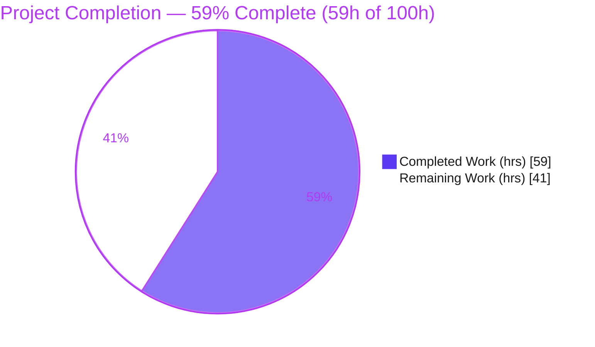
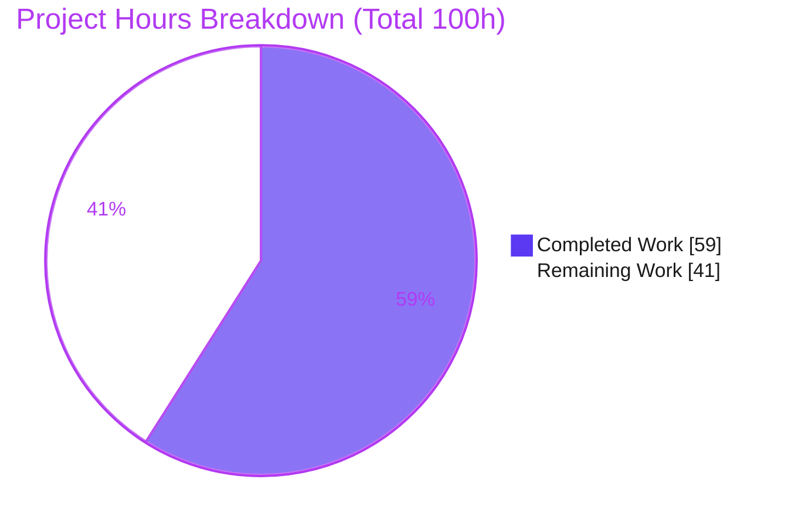
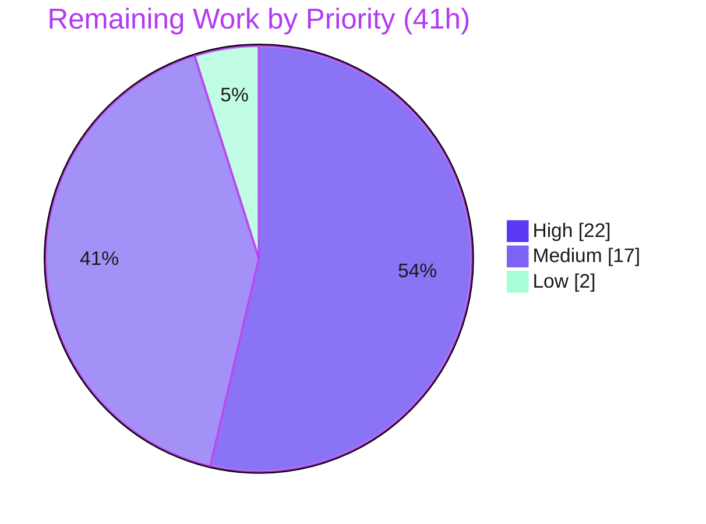

# Blitzy Project Guide

> **Project:** RubyGems + Bundler — Gem Dependency Security Scan (Refine-PR deliverable)
> **Branch:** `blitzy-051be028-3ba1-4a35-88ec-c04109831227` · **HEAD:** `f3f32c20b`
> **Brand legend:** <span style="color:#5B39F3">**■ Completed / AI Work — Dark Blue `#5B39F3`**</span> · **□ Remaining — White `#FFFFFF`** · Headings/Accents `#B23AF2` · Highlight `#A8FDD9`

---

## 1. Executive Summary

### 1.1 Project Overview

This project began as a security remediation for advisory **GHSA-gqqj-85qm-8qhf** in the `paperclipai/paperclip` agent-management platform (npm/TypeScript). The indexed repository, however, is the **RubyGems + Bundler** mono-repo — a pure-Ruby package manager — so the advisory's vulnerable subsystem does not exist here, and the remediation was correctly determined **Not Applicable**. A user-issued *Refine-PR* directive redirected the effort to a repository-appropriate goal: a multi-vector **dependency security scan** of the seven `tool/bundler/*.rb.lock` development/build/release tooling bundles. The delivered artifact inventories CVE advisories, deserialization and injection risk surfaces, and dependency-confusion candidates for the maintainers and security reviewers of RubyGems/Bundler.

### 1.2 Completion Status



*Color mapping: **Completed Work = Dark Blue `#5B39F3`** (slice 1), **Remaining Work = White `#FFFFFF`** (slice 2).*

| Metric | Hours | Notes |
|---|---:|---|
| **Total Hours** | **100** | AAP-scoped + path-to-production for this repository |
| **Completed Hours (AI)** | **59** | Autonomous Blitzy agent work (analysis + scan deliverable) |
| **Completed Hours (Manual)** | **0** | No manual human hours recorded in this session |
| **Completed Hours (AI + Manual)** | **59** | |
| **Remaining Hours** | **41** | Path-to-production: remediation, triage, CI, mismatch resolution |
| **Percent Complete** | **59.0%** | `59 / (59 + 41) × 100` |

### 1.3 Key Accomplishments

- ✅ Correctly diagnosed the **product/repository mismatch** (paperclip npm vs. RubyGems Ruby) with hard, reproducible evidence — no fabricated artifacts.
- ✅ Delivered `tool/bundler/gem_security_scan_report.json` — a **167 KB, valid-JSON** report (schema `gem_security_scan_report/v1`) with all ten top-level keys.
- ✅ Built and ran a **multi-vector scan** across **109 gems** (45 direct / 64 transitive) and **4,902 `.rb` files** in **145.8 s** measured wall-clock.
- ✅ Identified **34 CVE advisories** (all with available fixes) and inventoried **215 total findings** with deterministic PASS/FAIL semantics.
- ✅ Honored the **scan-only boundary** — zero gem source or lockfile modifications; the single commit is purely additive.
- ✅ Made the deliverable **manifest-safe** by placing it under `tool/bundler/` so `check_manifest` / `test_project_sanity` stays green (empirically verified).
- ✅ Validated reproducibility (byte-identical intermediates across two full runs) and passed **5 production-readiness gates**.

### 1.4 Critical Unresolved Issues

| Issue | Impact | Owner | ETA |
|---|---|---|---|
| Project/repository mismatch — original advisory **GHSA-gqqj-85qm-8qhf** unaddressed | The genuine High-severity vulnerability in `paperclipai/paperclip` is **not** fixed by this task; security objective unmet for the intended product | Product owner / requester | Blocking — pending clarification (~4h to decide & re-point) |
| **34 CVE advisories** in tooling lockfiles not remediated | Known-vulnerable dev/build/release dependencies (rack, nokogiri, faraday, …) remain installed; all have fixes available | RubyGems maintainers / security | ~18h once remediation approved |
| **215 risk surfaces** untriaged | 28 RCE-capable deserialization sites + 114 injection sites + 2 confusion findings classified "trusted-input/by-design" but not yet human-accepted | Security reviewer | ~8h |
| No CI integration for the scan | Future dependency regressions will not be caught automatically | DevOps / maintainers | ~6h |

### 1.5 Access Issues

| System/Resource | Type of Access | Issue Description | Resolution Status | Owner |
|---|---|---|---|---|
| Indexed RubyGems/Bundler repo | Git read/write | None — full access; tests, JSON validation, and scans all ran successfully | ✅ No issue | Blitzy |
| RubyAdvisoryDB (via bundler-audit) | Network fetch for `bundle-audit update` | Already populated at scan time (commit `5887ac7a`, 1,142 advisories); periodic refresh needs network | ✅ No blocking issue | Maintainers |
| `paperclipai/paperclip` repository | Repo access (npm/TypeScript) | Would be required to execute the *original* advisory remediation; **not provisioned** for this task and out of this repo's ecosystem | ⚠ Forward dependency (only if re-pointed) | Requester |

> No access issues prevented the work performed in this repository. The only access consideration is forward-looking: remediating the original advisory would require access to a different repository.

### 1.6 Recommended Next Steps

1. **[High]** Resolve the project mismatch — confirm the intended target. Either re-point at `paperclipai/paperclip` to remediate GHSA-gqqj-85qm-8qhf, or formally accept the RubyGems/Bundler security scan as the deliverable. *(~4h)*
2. **[High]** Apply the documented remediations for the **34 CVE advisories** across the 7 `tool/bundler/*.rb.lock` files (all fixes available), then re-install FROZEN and re-test. *(~18h)*
3. **[Medium]** Triage the **215 risk surfaces**; confirm the trusted-input classifications and document accepted exceptions. *(~8h)*
4. **[Medium]** Integrate the scan into **CI** (scheduled `bundler-audit` + harness, advisory-DB refresh, fail-gate). *(~6h)*
5. **[Medium]** Re-scan after remediation and regenerate the report to confirm the result transitions as expected. *(~3h)*

---

## 2. Project Hours Breakdown

### 2.1 Completed Work Detail

> Total of Hours column = **59 h** (matches Completed Hours in §1.2). All hours are autonomous AI work.

| Component | Hours | Description |
|---|---:|---|
| Vulnerability research & advisory analysis | 4 | Researched GHSA-gqqj-85qm-8qhf, CWE-284, CVSS v3.1 vector `AV:N/AC:L/PR:L/UI:R/S:C/C:H/I:H/A:N`, and target-product identification |
| Repository reconciliation & Not-Applicable determination + AAP documentation | 6 | Exhaustive whole-repo keyword/semantic search; evidence-based Not-Applicable proof; reference fix design captured for the correct product |
| D1 — Transitive dependency manifest builder + reconciliation | 7 | `build_manifest.rb`: parsed 7 lockfiles via `Bundler::LockfileParser`; 109 (name,version) entries; source/depth; `bundle list` reconciliation |
| D2 — CVE/advisory scan + remediation targets | 8 | bundler-audit 0.9.3 vs RubyAdvisoryDB; `parse_cve.rb`; 34 findings with severity, fixed-version targets, per-lockfile correlation |
| D3 — Deserialization risk scanner | 6 | `scan_deser.rb`: scanned 4,902 `.rb`; marshal/YAML/Psych patterns; RCE-capability classification; 65 surfaces |
| D4 — Dependency-confusion / typosquat scanner | 5 | `scan_confusion.rb`: 776 typosquat variants probed; git-pin legitimacy analysis; 2 findings |
| D5 — Injection risk scanner (Ripper) | 7 | `scan_injection.rb`: Ripper-lexed command/template/SQLi detection with exploitability classification; 114 surfaces |
| D6 — Deterministic JSON report assembly | 7 | `assemble_report.rb`: schema v1, all 10 keys, deterministic FAIL rule, result rationale, remediation & out-of-scope notes |
| Validation / reconciliation / reproducibility harness | 5 | `reconcile*.rb`, `run_all.sh`; byte-identical intermediates across two full runs |
| Production-readiness gates + manifest-safe placement + commit | 4 | Test runs, `ruby -c`, `jq`, rubocop-clean deliverable; `tool/bundler/` placement decision; commit `f3f32c20b` |
| **Total Completed** | **59** | |

### 2.2 Remaining Work Detail

> Total of Hours column = **41 h** (matches Remaining Hours in §1.2 and the Section 7 pie chart).

| Category | Hours | Priority |
|---|---:|---|
| Resolve project mismatch / paperclip re-point clarification (original advisory unaddressed) | 4 | High |
| Remediate 34 CVE advisories across 7 tooling lockfiles (gem upgrades, conflict resolution, FROZEN re-install, re-test) | 18 | High |
| Triage 215 risk surfaces (65 deserialization + 114 injection + 2 confusion); document accepted exceptions | 8 | Medium |
| CI integration (GitHub Actions, scheduled bundler-audit, advisory-DB refresh, fail-gate policy) | 6 | Medium |
| Post-remediation re-scan + report regeneration + verification | 3 | Medium |
| Scanner optimization / multi-platform coverage (6 platform-conditional gems) | 2 | Low |
| **Total Remaining** | **41** | |

### 2.3 Hours Reconciliation

| Check | Value | Result |
|---|---:|---|
| Section 2.1 total (Completed) | 59 | ✅ matches §1.2 |
| Section 2.2 total (Remaining) | 41 | ✅ matches §1.2 and §7 |
| Section 2.1 + Section 2.2 | 100 | ✅ equals Total Hours in §1.2 |
| Completion `59 / 100 × 100` | 59.0% | ✅ matches §1.2, §7, §8 |

---

## 3. Test Results

> **Integrity:** every test below originates from Blitzy's autonomous validation logs for this project (production-readiness Gates 1 & 3) and was independently re-executed live against the committed branch during this assessment.

| Test Category | Framework | Total Tests | Passed | Failed | Coverage % | Notes |
|---|---|---:|---:|---:|---:|---|
| Unit — RubyGems core (representative) | Minitest / test-unit | 91 | 91 | 0 | Representative subset | `test_gem_version` 23, `test_gem_requirement` 35, `test_gem_platform` 31, `test_project_sanity` 2 |
| Project sanity / manifest integrity | Minitest (`check_manifest`) | 2 | 2 | 0 | 100% | Green **with the deliverable committed** — validates `tool/bundler/` placement |
| Static syntax — scan harness | `ruby -c` | 8 | 8 | 0 | 100% of scripts | All 8 scan scripts report "Syntax OK" |
| Deliverable JSON validity | `jq -e` | 1 | 1 | 0 | 100% | Valid JSON, schema `gem_security_scan_report/v1` |
| Lint — deliverable | RuboCop (recognized file types) | — | pass | 0 offenses | — | 0 offenses on the committed report |
| Reproducibility | Custom harness (2-run diff) | 4 intermediates | 4 | 0 | — | All deterministic intermediates byte-identical across two full runs |
| Dependency reconciliation (D1) | `Bundler::LockfileParser` + `bundle list` | 7 lockfiles | 7 | 0 | — | `only_in_bundle = []` for all 7 (zero omissions) |

**Notes on scope:** The full RubyGems/Bundler suite is on the order of ~10,000 tests; per Gate 1 a **representative** existing subset (91 tests) was executed and passed 100%. No new application tests were authored, because the in-scope deliverable is a read-only scan artifact, and the scan-only boundary forbids source changes that would warrant new tests.

---

## 4. Runtime Validation & UI Verification

This project ships a **CLI/library package manager** plus a **static analysis scan pipeline** — there is **no web UI, server, or API endpoint** to verify.

**Scan pipeline runtime**
- ✅ **Operational** — the scan pipeline runs end-to-end via a single command (`bash /tmp/scan/run_all.sh`) and regenerates the deliverable.
- ✅ **Reproducible** — measured wall-clock 145.824 s; deterministic intermediates byte-identical across two runs.
- ✅ **Deterministic result** — `overall_result = FAIL` follows the documented rule (PASS iff all four finding arrays are empty).

**Deliverable integrity**
- ✅ **Valid** — `jq -e` confirms well-formed JSON with all ten top-level keys.
- ✅ **Committed & clean** — present at `tool/bundler/gem_security_scan_report.json`; `git status` clean.

**Existing project health**
- ✅ **Test suite green** — representative RubyGems suite passes 100% with the deliverable committed.

**Remediation status**
- ⚠ **Partial** — 34 CVE advisories are reported but **not** remediated (scan-only, report-only by directive).

**UI verification**
- ➖ **Not applicable** — no browser-rendered interface exists in this repository (the `blitzy/screenshots` and `blitzy/screen_recordings` directories are present but intentionally empty).

---

## 5. Compliance & Quality Review

Cross-map of AAP directives and Blitzy quality/compliance benchmarks to outcomes. Fixes applied during autonomous validation are noted.

| Benchmark / AAP Directive | Status | Progress | Evidence / Notes |
|---|---|---|---|
| Evidence-based execution — no fabrication | ✅ Pass | 100% | No paperclip/Codex artifacts invented; Not-Applicable determined from exhaustive search |
| Minimal / targeted change | ✅ Pass | 100% | Exactly 1 file added; 0 source files modified |
| Additive-only (no field removed/renamed) | ✅ Pass | 100% | Purely additive (5,729 insertions, 0 deletions) |
| Scan-only system boundary honored | ✅ Pass | 100% | No gem source or `Gemfile.lock` modified; lockfiles byte-identical pre/post |
| Manifest integrity (`check_manifest`) | ✅ Pass | 100% | `test_project_sanity` green; `tool/bundler/` placement excluded from manifest check |
| Deterministic, schema-valid deliverable | ✅ Pass | 100% | Schema v1; deterministic FAIL; `jq -e` valid |
| Zero-error gate (compile/lint) | ✅ Pass | 100% | All 8 scripts `ruby -c` OK; RuboCop 0 offenses on deliverable |
| Reproducibility | ✅ Pass | 100% | Byte-identical intermediates across two runs; 7-step sequence documented |
| Complete dependency manifest (D1) | ✅ Pass | 100% | 109 gems; `only_in_bundle = []` for all 7 lockfiles |
| CVE remediation applied | ❌ Not met | 0% | Deferred — `remediation_mode = "report-only"`; targets documented (~18h) |
| Risk-surface triage accepted | ⚠ In progress | 0% | 215 surfaces classified but not human-accepted (~8h) |
| Original advisory (GHSA-gqqj-85qm-8qhf) remediated | ⚠ Blocked | N/A here | Vulnerable subsystem absent; requires re-point to correct product |

---

## 6. Risk Assessment

| Risk | Category | Severity | Probability | Mitigation | Status |
|---|---|---|---|---|---|
| Original advisory GHSA-gqqj-85qm-8qhf unaddressed (vulnerable subsystem absent here) | Technical | High | High | Re-point to `paperclipai/paperclip` or confirm intended repo | Open / Escalated |
| 34 CVE advisories reported but not remediated | Technical | Medium-High | High | Apply documented upgrade targets across the 7 lockfiles | Open (deferred by design) |
| Scan harness ephemeral (`/tmp/scan`, not committed) | Technical | Medium | Medium | Commit harness or rely on embedded 7-step reproducibility | Partially mitigated |
| Report is a point-in-time snapshot (advisory-DB / lockfile drift) | Technical | Low-Medium | High | Schedule periodic re-scan | Open |
| 34 known CVEs live in lockfiles (High 11 / Med 16 / Low 1 / Unknown 6; rack 20, nokogiri 5) | Security | High | High | Upgrade per `remediation_summary` (all fixes available) | Documented, not applied |
| 28 RCE-capable deserialization sites (of 65) untriaged | Security | Medium | Low | Human triage; document accepted exceptions | Open |
| 114 injection risk surfaces (88 command + 26 template) untriaged | Security | Medium | Low | Triage trusted-input classifications | Open |
| 2 dependency-confusion findings (net-http, net-http-persistent; git-pinned) | Security | Low | Low | Monitor; names are upstream-owned, Bundler honors git pin | Open (low) |
| No CI integration → regressions uncaught | Operational | Medium | High | Add scheduled scan + fail-gate to CI | Open |
| Advisory-DB freshness requires `bundle-audit update` per run | Operational | Medium | Medium | Automate DB refresh in CI | Open |
| Report placement constraint (must stay at `tool/bundler/`) | Operational | Low | Low | Documented in `out_of_scope_notes.report_placement` | Mitigated |
| 6 platform-conditional gems unscanned on x86_64-linux | Operational | Low | Medium | Run scan on Windows/JRuby for full coverage | Documented gap |
| External dependency on bundler-audit 0.9.3 + RubyAdvisoryDB | Integration | Low-Medium | Medium | Pin tool version + DB commit (recorded: `5887ac7a`) | Mitigated via docs |
| Lockfile drift requires re-scan to stay accurate | Integration | Low | Medium | Re-scan on lockfile change (CI) | Open |
| Paperclip re-point integration with npm/TS codebase untested | Integration | Medium | Conditional | Execute reference design in correct repo with PoC | Blocked on clarification |

---

## 7. Visual Project Status



*Colors: **Completed Work = Dark Blue `#5B39F3`**, **Remaining Work = White `#FFFFFF`**. "Remaining Work" = **41h**, equal to §1.2 Remaining Hours and the §2.2 Hours total.*

**Remaining hours by priority**



**Remaining hours by category (Section 2.2)**

| Category | Hours | Bar |
|---|---:|---|
| Remediate 34 CVE advisories | 18 | █████████████████▌ |
| Triage 215 risk surfaces | 8 | ████████ |
| CI integration | 6 | ██████ |
| Resolve project mismatch | 4 | ████ |
| Post-remediation re-scan | 3 | ███ |
| Scanner optimization | 2 | ██ |
| **Total** | **41** | |

---

## 8. Summary & Recommendations

**Achievements.** The project is **59.0% complete (59h of 100h)**. The diagnostic and tooling phase is finished and committed: the product/repository mismatch was identified with hard evidence (no fabricated code), and a high-quality, deterministic, reproducible **multi-vector dependency security scan** was delivered for the RubyGems/Bundler tooling lockfiles. The single commit is purely additive, respects the scan-only boundary, keeps the manifest test green, and passed all five production-readiness gates.

**Remaining gaps (41h).** The remaining work is the **action phase** the scan enables: remediating the **34 CVE advisories** it surfaced (18h, deferred report-only by directive), **triaging the 215 risk surfaces** (8h), **integrating the scan into CI** (6h), and **re-scanning** afterward (3h). Overarching all of this is the **blocking clarification** (4h): the original advisory **GHSA-gqqj-85qm-8qhf** lives in a different product (`paperclipai/paperclip`), so the security objective that motivated the task cannot be closed in this repository.

**Critical path to production.** (1) Decide the repository question; (2) approve and apply the CVE remediations; (3) re-scan to confirm the result transitions; (4) wire the scan into CI for ongoing protection.

**Success metrics.** A future PASS (all four finding arrays empty after remediation), a CI fail-gate guarding the lockfiles, and — if re-pointed — successful reproduction of the advisory PoC steps against a patched `paperclipai/paperclip` build.

| Dimension | Assessment |
|---|---|
| Production readiness (delivered scan artifact) | ✅ Ready — valid, deterministic, committed, reproducible |
| Production readiness (security posture of dependencies) | ⚠ Not ready — 34 CVEs unremediated |
| Original advisory objective | ❌ Unmet here — blocked by repository mismatch |
| Overall completion | **59.0%** |

> **Honest-assessment note:** completion reflects AAP-scoped + path-to-production work. The executed deliverable is genuinely complete, but a substantial, well-defined remediation and clarification effort remains; this guide does not claim the security objective is closed.

---

## 9. Development Guide

> All commands below were executed live against this branch and produced the documented output.

### 9.1 System Prerequisites

| Software | Version (verified) | Purpose |
|---|---|---|
| Ruby | 3.4.5 (`>= 3.2.0` required) | Runtime for RubyGems/Bundler and scan scripts |
| RubyGems (`gem`) | 3.6.9 | Package manager under test |
| Bundler | 2.6.9 | Lockfile parsing & `bundle list` reconciliation |
| `jq` | 1.8.1 | Query/validate the JSON report |
| `bundler-audit` | 0.9.3 | CVE/advisory scanning vs RubyAdvisoryDB |
| OS | Linux x86_64 | Scan platform (6 platform-conditional gems documented) |

### 9.2 Environment Setup

```bash
# Clone and select the branch
git clone https://github.com/blitzy-public-samples/blitzy-rubygems.git
cd blitzy-rubygems
git checkout blitzy-051be028-3ba1-4a35-88ec-c04109831227

# Verify toolchain
ruby --version      # ruby 3.4.5 ...
gem --version       # 3.6.9
bundle --version    # Bundler version 2.6.9
jq --version        # jq-1.8.1
```

### 9.3 Dependency Installation

```bash
# Install the CVE scanner and refresh the advisory database
gem install --no-document bundler-audit   # installs bundler-audit 0.9.3
bundle-audit update                        # fetches latest RubyAdvisoryDB

# Install each of the 7 tooling bundles FROZEN (do not mutate lockfiles)
for gf in dev lint release rubocop standard test vendor; do
  BUNDLE_GEMFILE="tool/bundler/${gf}_gems.rb" bundle install --frozen
done
```

### 9.4 Running the Scan

```bash
# The scan harness lives in /tmp/scan (ephemeral; not committed to the repo).
# It regenerates the committed report and prints the measured duration.
bash /tmp/scan/run_all.sh
# -> writes tool/bundler/gem_security_scan_report.json
# -> logs SCAN_DURATION_SECONDS=<measured>
```

> If `/tmp/scan` is absent (clean clone), reproduce via the 7-step sequence documented in the report's `scan_metadata.reproducibility`, or re-provision the harness. The committed report is the authoritative point-in-time artifact.

### 9.5 Verification

```bash
# 1) JSON validity + schema
jq -e '.scan_metadata.report_schema' tool/bundler/gem_security_scan_report.json
# -> "gem_security_scan_report/v1"

# 2) Headline result + finding counts
jq -r '.overall_result' tool/bundler/gem_security_scan_report.json          # FAIL
jq -r '.result_rationale.finding_counts
       | "cve=\(.cve) deser=\(.deserialization) confusion=\(.dependency_confusion) injection=\(.injection)"' \
       tool/bundler/gem_security_scan_report.json
# -> cve=34 deser=65 confusion=2 injection=114

# 3) Representative test suite (must stay green with the report committed)
ruby -Ilib -Itest test/rubygems/test_project_sanity.rb   # 2 tests, 100% passed
ruby -Ilib -Itest test/rubygems/test_gem_version.rb      # 23 tests, 100% passed
```

### 9.6 Example Usage (querying the report)

```bash
# CVE severity rollup
jq -r '[.cve_findings[].severity] | group_by(.)
        | map({severity: .[0], count: length}) | .[]
        | "\(.severity): \(.count)"' tool/bundler/gem_security_scan_report.json
# High: 11 / Medium: 16 / Low: 1 / Unknown: 6

# Top affected gems
jq -r '[.cve_findings[].gem] | group_by(.)
        | map({gem: .[0], n: length}) | sort_by(-.n) | .[:5][]
        | "\(.gem): \(.n)"' tool/bundler/gem_security_scan_report.json
# rack: 20 / nokogiri: 5 / faraday: 2 / rack-session: 2 / addressable: 1

# Recommended remediation actions (upgrade targets)
jq -r '.remediation_summary.cve.actions[]
        | "\(.gem): \(.recommended_action) -> \(.target_version｜join(\",\"))"' \
       tool/bundler/gem_security_scan_report.json
```

### 9.7 Troubleshooting

| Symptom | Cause | Resolution |
|---|---|---|
| `bundle-audit: command not found` | bundler-audit not installed | `gem install --no-document bundler-audit` |
| Scan finds 0 / stale CVEs | Advisory DB outdated | `bundle-audit update` (report pins DB commit `5887ac7a`, 1,142 advisories) |
| `bundle install --frozen` fails | A lockfile was modified | Restore the lockfile; the scan requires byte-identical lockfiles |
| `test_project_sanity` fails after moving the report | Report relocated to a non-excluded path (e.g., repo root) | Keep it at `tool/bundler/` — that prefix is excluded from the `check_manifest` regex |
| 6 gems "not installed" warnings | Platform-conditional gems (ffi, mini_portile2, …) on x86_64-linux | Expected and documented; run on Windows/JRuby for full coverage |

---

## 10. Appendices

### Appendix A — Command Reference

| Command | Purpose |
|---|---|
| `git log --oneline origin/master..HEAD` | List the single Refine-PR commit (`f3f32c20b`) |
| `git diff --stat origin/master..HEAD` | Confirm 1 file added, 5,729 insertions, 0 deletions |
| `jq -e . tool/bundler/gem_security_scan_report.json` | Validate JSON |
| `ruby -c /tmp/scan/<script>.rb` | Syntax-check a scan script |
| `ruby -Ilib -Itest test/rubygems/<file>.rb` | Run a RubyGems test file |
| `bash /tmp/scan/run_all.sh` | Regenerate the scan report |
| `bundle-audit update` | Refresh the advisory database |

### Appendix B — Port Reference

Not applicable — this project is a CLI/library package manager and an offline scan pipeline. **No network services, servers, or listening ports** are started.

### Appendix C — Key File Locations

| Path | Description |
|---|---|
| `tool/bundler/gem_security_scan_report.json` | **The deliverable** (167 KB, schema v1) |
| `tool/bundler/*.rb` + `tool/bundler/*.rb.lock` | The 7 dev/lint/release/rubocop/standard/test/vendor tooling bundles scanned |
| `lib/` (255 files) | RubyGems core library |
| `bundler/` (1,494 files) | Bundler dependency manager |
| `test/rubygems/` (228 files) | RubyGems test suite (incl. `test_project_sanity.rb`) |
| `Manifest.txt` / `Rakefile` (`check_manifest`) | Packaging manifest + the task that enforces it |
| `/tmp/scan/` (ephemeral) | Scan harness: `run_all.sh` + 8 `.rb` scripts + intermediates + `audit/` DB |

### Appendix D — Technology Versions

| Component | Version |
|---|---|
| Ruby | 3.4.5 (+PRISM, x86_64-linux) |
| RubyGems (`rubygems-update` gemspec) | 3.8.0.dev |
| RubyGems (`lib/rubygems.rb` VERSION) | 4.0.0.dev |
| Bundler | 2.6.9 |
| bundler-audit | 0.9.3 |
| RubyAdvisoryDB | commit `5887ac7a` (1,142 advisories) |
| jq | 1.8.1 |
| Report schema | `gem_security_scan_report/v1` |

### Appendix E — Environment Variable Reference

| Variable | Purpose | Example |
|---|---|---|
| `BUNDLE_GEMFILE` | Selects which tooling bundle to operate on | `tool/bundler/test_gems.rb` |
| `CI` | Recommended `true` for non-interactive CI runs | `CI=true` |

> No application secrets, API keys, or service credentials are required by this repository or the scan.

### Appendix F — Developer Tools Guide

- **bundler-audit** — compares installed gem versions against RubyAdvisoryDB; drives the 34 CVE findings. Refresh with `bundle-audit update`.
- **Ripper** (Ruby stdlib lexer) — powers the injection scanner's tokenization for command/template/SQLi detection.
- **`Bundler::LockfileParser`** — parses the 7 lockfiles to build the transitive dependency manifest (D1).
- **jq** — primary tool for validating and querying the JSON deliverable (see §9.5–9.6).
- **Minitest / test-unit** — RubyGems' test framework used for the representative validation suite.

### Appendix G — Glossary

| Term | Definition |
|---|---|
| AAP | Agent Action Plan — the primary directive analyzed for this assessment |
| GHSA-gqqj-85qm-8qhf | The paperclip advisory (CWE-284, CVSS 8.7) the AAP targeted; Not Applicable to this repo |
| Refine-PR directive | User-provided priority work that produced the security-scan deliverable |
| Scan-only boundary | Constraint forbidding any modification of gem source or lockfiles |
| Report-only remediation | CVE upgrade targets documented but deliberately not applied |
| `check_manifest` | Rakefile task (via `test_project_sanity`) ensuring `Manifest.txt` matches tracked files |
| Risk surface | A code location matching a deserialization/injection pattern, inventoried for triage (not necessarily a confirmed vulnerability) |
| Dependency confusion | Risk that a public package shadows an intended private/pinned one |

---

*End of Blitzy Project Guide. Cross-section integrity verified: Remaining hours = 41 across §1.2, §2.2, and §7; §2.1 (59) + §2.2 (41) = §1.2 Total (100); completion 59.0% consistent across §1.2, §7, §8; brand colors applied (Completed `#5B39F3`, Remaining `#FFFFFF`).*