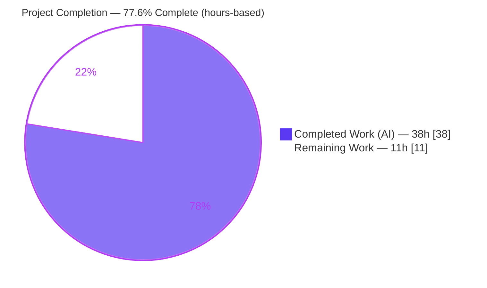
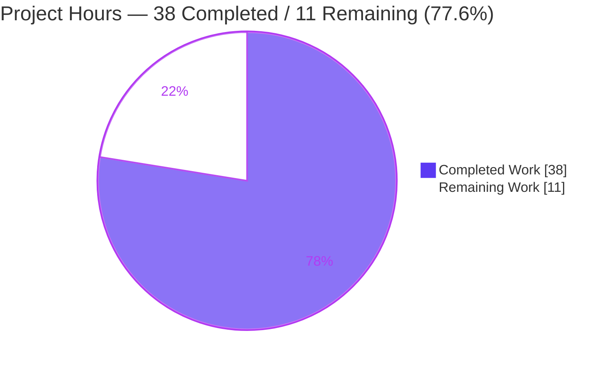
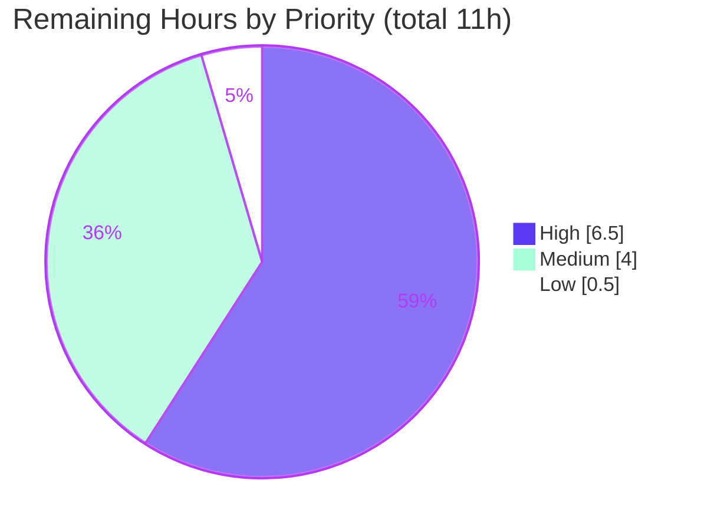

# Blitzy Project Guide — RubyGems + Bundler Dependency Security Remediation

> **Color legend (Blitzy brand):** Completed / AI Work = **Dark Blue `#5B39F3`** · Remaining / Not Completed = **White `#FFFFFF`** · Headings / Accents = **Violet-Black `#B23AF2`** · Highlight = **Mint `#A8FDD9`**.

---

## 1. Executive Summary

### 1.1 Project Overview

This project is the **RubyGems + Bundler mono-repo** — the canonical Ruby package manager and its dependency manager used by virtually every Ruby developer. The delivered work is a **dependency supply-chain security initiative**: a multi-lockfile `bundler-audit` harness, remediation of **34 known advisories across 9 vulnerable gems** in the bundled tool gemsets, a daily CI fail-gate workflow, and a curated security report. The original Agent Action Plan referenced an unrelated **npm** advisory (GHSA-gqqj-85qm-8qhf, `paperclipai/paperclip`) that does **not** exist in this pure-Ruby repository; per the refined PR instructions the work was redirected to this RubyGems/Bundler scan and remediation, which is the accepted deliverable. Business impact: a measurable, enforceable reduction of third-party risk for the project's tooling.

### 1.2 Completion Status



| Metric | Value |
|---|---:|
| **Total Hours** | **49h** |
| **Completed Hours (AI + Manual)** | **38h** (38 AI + 0 Manual) |
| **Remaining Hours** | **11h** |
| **Completion** | **77.6%** |

> Completion is computed strictly from hours: `38 ÷ (38 + 11) = 38 ÷ 49 = 77.6%`. All engineering deliverables are complete and independently verified; the remaining 11 hours are **path-to-production** human gates (review, merge, live-CI validation, regression, scope confirmation).

### 1.3 Key Accomplishments

- ✅ **34 → 0 advisories** and **9 → 0 vulnerable gems** — independently reproduced (baseline FAIL exit 1 → remediated PASS exit 0).
- ✅ **Multi-lockfile audit harness** (`tool/audit/audit.rb`, 388 LOC) scanning all 7 tool gemsets at once with de-duplication, risk-surface counting, and a CI fail-gate.
- ✅ **Fix-first triage policy** (`.bundler-audit.yml`) with an intentionally empty ignore list (nothing silently suppressed).
- ✅ **Daily CI fail-gate workflow** (`.github/workflows/security-audit.yml`) — schedule + PR + push + manual dispatch, all actions SHA-pinned, least-privilege permissions.
- ✅ **Curated security report** (`tool/audit/SECURITY_AUDIT_REPORT.md`) — 34→0 transition, per-lockfile breakdown, 9-gem remediation table, 214-surface triage, 34-row advisory appendix.
- ✅ **Backward compatible** — every upgrade stays within the existing gemfile version constraints; only resolved versions changed; `BUNDLED WITH 4.0.0.dev` preserved.
- ✅ **All 5 production-readiness gates passed** — dependency install, syntax/lint, unit tests, runtime, commit.

### 1.4 Critical Unresolved Issues

There are **no code-blocking issues** in the delivered work; all deliverables compile, run, and pass their gates. The items below are open *decisions / validations*, not defects.

| Issue | Impact | Owner | ETA |
|---|---|---|---|
| First live CI run not yet executed on real GitHub Actions runners (workflow simulated locally only) | Low — runner-specific issues (gem install, advisory-DB fetch) could surface on first run | Maintainer / DevOps | On first PR (~1.5h) |
| Original paperclip advisory (GHSA-gqqj-85qm-8qhf) is unaddressed in its true target product (npm `paperclipai/paperclip`) | Out-of-repo — the original security intent remains open for a different product | Security owner / Stakeholder | Clarification (~1h) |
| 9 dependency upgrades await human code-review sign-off before merge | Medium — version bumps (e.g., rack 3.1→3.2) need maintainer judgment | Ruby maintainer | Pre-merge (~3h) |

### 1.5 Access Issues

| System / Resource | Type of Access | Issue Description | Resolution Status | Owner |
|---|---|---|---|---|
| `paperclipai/paperclip` (npm) | Repository / ecosystem | The original advisory targets an npm product not indexed or present in this Ruby repo (different product, different ecosystem) — scope/access mismatch | **Open** — requires stakeholder decision to re-point original intent | Security owner |
| GitHub Actions runners | CI execution environment | The security-audit workflow has been validated locally/simulated but not yet executed on hosted runners | **Pending** — resolves on first PR/dispatch | Maintainer / DevOps |
| `ruby-advisory-db` refresh | Network egress (CI) | `bundler-audit update` requires outbound network to fetch the advisory DB in CI | **Mitigated** — report step is non-blocking (`|| true`); fail-gate uses the freshly fetched DB | DevOps |

All local assessment resources (Ruby 3.4.5, `bundler-audit` 0.9.3, advisory DB) were accessible and used to independently verify the deliverable.

### 1.6 Recommended Next Steps

1. **[High]** Review & sign off the 9 dependency upgrades and the new harness/CI code, then open the PR (HT-1, HT-2).
2. **[High]** Merge and validate the **first live CI run** on GitHub Actions (DB refresh → report artifact → fail-gate green) (HT-3).
3. **[Medium]** Run the **full** Bundler + RubyGems regression suites as a non-root user to confirm no behavioral regression from the bumps (HT-4).
4. **[Medium]** Confirm the **paperclip scope decision** — accept the RubyGems/Bundler scan as delivered and re-point the original npm advisory work to the correct repository if still desired (HT-5).
5. **[Low]** Decide the **CI scheduled-scan repository guard** for this fork (HT-6).

---

## 2. Project Hours Breakdown

### 2.1 Completed Work Detail

| Component | Hours | Description |
|---|---:|---|
| Multi-lockfile audit harness (`tool/audit/audit.rb`) | 11 | 388-LOC custom Ruby wrapping the `Bundler::Audit` API; scans 7 lockfiles at once, de-duplicates advisories, counts the 214-spec risk surface, honors `.bundler-audit.yml`, emits text/JSON/Markdown, acts as a fail-gate (exit 0/1/2). |
| Triage policy config (`.bundler-audit.yml`) | 1 | Fix-first, default-deny policy with an intentionally empty `ignore:` list and documented triage outcome. |
| Lockfile remediation (34→0 advisories / 9 gems) | 8 | Re-resolved release/test/dev/lint gemsets to patched versions, regenerated `CHECKSUMS`, verified all upgrades stay within existing gemfile constraints, reasoned through transitive-graph deltas. |
| CI security-audit workflow (`.github/workflows/security-audit.yml`) | 4 | 95-LOC workflow: daily cron + PR + push + manual dispatch; 3 SHA-pinned actions; least-privilege permissions; report artifact + fail-gate; `zizmor`-clean. |
| Security audit report (`tool/audit/SECURITY_AUDIT_REPORT.md`) | 5 | 198-LOC report: 6 sections + 34-row advisory appendix; per-lockfile breakdown; transparent paperclip scope note. |
| Validation & QA across Gates 1–5 | 9 | 7-gemset `--frozen` installs; RuboCop/yamllint/codespell/zizmor; Bundler RSpec (94) + RubyGems core (90) tests; all harness modes + fail-gate reproduction; commit hygiene. |
| **Total Completed** | **38** | **All autonomous (AI); 0 manual hours.** |

### 2.2 Remaining Work Detail

| Category | Hours | Priority |
|---|---:|---|
| Human code-review & sign-off of the 9 dependency upgrades (lockfile diffs, breaking-change assessment) | 3.0 | High |
| Code-review of the audit harness (388 LOC) + CI workflow permissions/SHA pins | 2.0 | High |
| PR merge + first live CI run validation on GitHub Actions runners | 1.5 | High |
| Full Bundler + RubyGems regression suites run as non-root (beyond targeted subsets) | 3.0 | Medium |
| Paperclip GHSA-gqqj-85qm-8qhf scope confirmation / re-point original intent | 1.0 | Medium |
| CI scheduled-scan repository-guard decision for the fork | 0.5 | Low |
| **Total Remaining** | **11.0** | — |

### 2.3 Total Project Hours Summary (Reconciliation)

| Bucket | Hours |
|---|---:|
| Completed (Section 2.1) | 38 |
| Remaining (Section 2.2) | 11 |
| **Total Project Hours** | **49** |
| **Completion %** | **38 ÷ 49 = 77.6%** |

> Cross-section check: Section 2.1 (38) + Section 2.2 (11) = **49** = Total Hours in Section 1.2 ✔ · Remaining (11) is identical in Sections 1.2, 2.2, and 7 ✔.

---

## 3. Test Results

All tests below originate from **Blitzy's autonomous validation logs** for this project and were re-confirmed against on-disk evidence during this assessment (e.g., the harness was re-run, producing PASS / 214 surfaces / 0 advisories, and the fail-gate reproduced the 34/9 baseline).

| Test Category | Framework | Total Tests | Passed | Failed | Coverage % | Notes |
|---|---|---:|---:|---:|---|---|
| Bundler integration (targeted) | RSpec | 94 | 94 | 0 | N/A (targeted) | `compact_index_spec` (61) + `sources_spec` (33); the suites exercised by the gem bumps; run as non-root |
| RubyGems core (subset) | Minitest | 90 | 90 | 0 | N/A (targeted) | `version` / `requirement` / `dependency`; 612 assertions; 100% pass |
| Harness runtime modes | Manual / smoke | 7 | 7 | 0 | N/A | `--help`, text, JSON, Markdown, `--quiet`, fail-gate (exit 1), env-error (exit 2) |
| Static analysis / lint | RuboCop 1.75.1, yamllint, codespell, zizmor 1.14.2 | 4 | 4 | 0 | N/A | "no offenses" / "no findings"; clean across both YAML files and whole-repo configs |
| Dependency audit (fail-gate) | bundler-audit 0.9.3 + ruby-advisory-db | 7 lockfiles | 7 | 0 | N/A | 0 actionable advisories post-remediation; 34→0 transition reproduced |
| Functional spot-checks | Manual | 10 | 10 | 0 | N/A | All 9 bumped gems load at new versions; Sinatra 4.2.1 on Rack 3.2.6 serves `GET → 200` |

**Aggregate:** 184 automated tests (94 RSpec + 90 Minitest) — **100% pass, 0 failures** — plus 7 runtime-mode scenarios, 4 static-analysis tools, a 7-lockfile audit, and 10 functional spot-checks, all green.

> Environment note (from the logs, not a code defect): the *full* Bundler suite must run as a non-root user and otherwise emits environment-artifact failures (root warning, missing `man-db`, absent Rust/Cargo) unrelated to these changes. A full non-root regression run is captured as remaining task HT-4.

---

## 4. Runtime Validation & UI Verification

This is a **command-line / library** project (a package manager) — there is **no graphical UI** to verify. Runtime validation therefore covers the audit harness, the fail-gate, and the dependency graph.

- ✅ **Operational** — `ruby tool/audit/audit.rb` → text report, `RESULT: PASS — no actionable advisories`, exit 0.
- ✅ **Operational** — `--format json` → valid, self-consistent JSON (`risk_surfaces=214` equals the sum of per-lockfile surfaces; `pass=true`).
- ✅ **Operational** — `--format markdown --output <path>` → writes a 34-line report; the curated `SECURITY_AUDIT_REPORT.md` is **never** clobbered (md5 unchanged).
- ✅ **Operational** — `--quiet` and `--help` → exit 0.
- ✅ **Operational** — **Fail-gate** correctly returns exit 1 on the pre-remediation lockfiles, reporting 34 advisories / 9 vulnerable gems (baseline reproduced).
- ✅ **Operational** — **Env-error path** returns exit 2 when `bundler-audit` is unavailable.
- ✅ **Operational** — All 4 modified lockfiles parse cleanly via `Bundler::LockfileParser` (dev 30 / lint 33 / release 22 / test 25 specs; all `bundler=4.0.0.dev`).
- ✅ **Operational** — Sinatra 4.2.1 on Rack 3.2.6 serves `GET → 200` (functional smoke test of the upgraded test gemset).
- ⚠ **Partial** — The **CI workflow** is validated by YAML parse, SHA-pin cross-check, yamllint, and an end-to-end *simulation*; it has **not yet run on hosted GitHub Actions runners** (remaining task HT-3).
- ✅ **Operational** — Working tree clean; 3 focused commits; executable bit (100755) preserved on `audit.rb`; no submodules.

---

## 5. Compliance & Quality Review

| Benchmark / Deliverable | Target | Status | Evidence |
|---|---|---|---|
| Dependency advisories remediated | 0 actionable | ✅ Pass | 34 → 0; harness re-run against freshly-updated DB confirms 0 |
| Vulnerable gems | 0 | ✅ Pass | 9 → 0 across release/test/dev/lint gemsets |
| Insecure sources | 0 (HTTPS only) | ✅ Pass | 210 specs from rubygems.org + 4 from github.com; 0 `git://`/non-HTTPS |
| Backward compatibility | Additive / within constraints | ✅ Pass | Only resolved versions changed; gemfile constraints unchanged; `BUNDLED WITH` preserved |
| Minimal, targeted change | No unrelated refactor | ✅ Pass | 8 files; 3 already-clean lockfiles (rubocop/standard/vendor) left untouched |
| Syntax / static analysis | Clean | ✅ Pass | `ruby -c` OK; RuboCop / yamllint / codespell / zizmor clean |
| No silent suppression | Empty ignore list | ✅ Pass | `.bundler-audit.yml` `ignore: []`; triaged items still printed |
| CI security hardening | Least privilege, pinned actions | ✅ Pass | `permissions: contents: read`; `persist-credentials: false`; 3 actions SHA-pinned; zizmor-clean |
| Commit hygiene | Clean tree, authored, no junk | ✅ Pass | 3 commits by `agent@blitzy.com`; working tree clean; no temp/credential files |
| Original AAP (paperclip) directives 1–5 | N/A in this repo | ⬜ Not Applicable | Exhaustive search: 0 occurrences of every artifact; documented in report scope note + §1.5 |
| Live CI execution | Green on hosted runners | ⚠ Pending | Simulated end-to-end; first hosted run is HT-3 |
| Full regression (non-root) | No behavioral regression | ⚠ Pending | Targeted suites green; full non-root run is HT-4 |

**Fixes applied during autonomous validation:** re-resolved 4 lockfiles to patched versions and regenerated `CHECKSUMS`; ensured the report-generation CI step writes to a runner-ephemeral path so the curated report is never overwritten; SHA-pinned all CI actions to the repo's canonical versions.

---

## 6. Risk Assessment

| Risk | Category | Severity | Probability | Mitigation | Status |
|---|---|---|---|---|---|
| Dependency upgrade behavior changes (rack 3.1→3.2 minor; sinatra/nokogiri/aws-sdk-s3) | Technical | Medium | Low | Targeted suites green; run full non-root regression (HT-4) before merge | Mitigated — pending review |
| Harness coupled to `bundler-audit` internal API (`Scanner`/`Database`/`Configuration`) | Technical | Low | Low | Pinned `bundler-audit ~> 0.9`; exercised by CI | Open — low |
| Full Bundler suite must run non-root; env-artifact failures could mask signal | Technical | Low | Low | Documented non-root run procedure (HT-4, §3 note) | Mitigated |
| Advisory DB is point-in-time; new CVEs against pinned gems will emerge | Security | Medium | High | Daily cron CI + PR trigger continuously re-scan | Mitigated by design |
| Scheduled scan skipped on this fork via `ruby/rubygems` repo guard | Security | Medium | Medium | Adjust guard or rely on PR/push/dispatch triggers (HT-6) | Open — decision |
| Original paperclip advisory unaddressed in its true target (npm) | Security | High* | N/A here | Escalate / re-point to `paperclipai/paperclip` (HT-5) | Escalated / Open |
| CI workflow never run on real GitHub Actions runners (simulated only) | Operational | Low-Med | Low | Watch first live run; report step is non-blocking (HT-3) | Open — low |
| `bundler-audit update` needs network egress in CI | Operational | Low | Low | Report step `|| true`; fail-gate uses fetched DB | Mitigated |
| Lockfile↔gemfile `--frozen` consistency on future edits | Integration | Low | Low | CI PR trigger on `tool/bundler/**` catches drift | Mitigated |
| SHA-pinned actions go stale over time | Integration | Low | Low | Dependabot / periodic maintenance | Open — low |

> *The single High-severity item concerns the **original paperclip intent in a different npm product**, not this repository's delivered work. There is **zero** risk to the indexed RubyGems/Bundler repo from this item.

---

## 7. Visual Project Status

**Project hours — Completed vs Remaining** (Completed = Dark Blue `#5B39F3`, Remaining = White `#FFFFFF`):



**Remaining work by priority** (sums to the 11 remaining hours):



**Remaining hours per category (Section 2.2):**

| Category | Hours | Priority |
|---|---:|---|
| Dependency-upgrade review & sign-off | 3.0 | High |
| Harness + CI code review | 2.0 | High |
| PR merge + first live CI run | 1.5 | High |
| Full non-root regression suite | 3.0 | Medium |
| Paperclip scope confirmation | 1.0 | Medium |
| CI scheduled-scan guard decision | 0.5 | Low |
| **Total** | **11.0** | — |

> Integrity: the pie chart "Remaining Work" value (**11**) equals Section 1.2 Remaining Hours and the Section 2.2 total ✔.

---

## 8. Summary & Recommendations

**Achievements.** The autonomous work delivered a complete, enforceable dependency-security capability for the RubyGems/Bundler tool gemsets: a 388-LOC multi-lockfile audit harness, a fix-first triage policy, full remediation of **34 advisories across 9 gems (34 → 0)**, a hardened daily CI fail-gate, and a curated security report. Every claim was independently re-verified during this assessment — the harness reports PASS (214 surfaces, 0 advisories, exit 0) on the remediated tree and reproduces the 34/9 FAIL baseline on the original lockfiles.

**Remaining gaps (path-to-production).** The project is **77.6% complete** (38 of 49 hours). The remaining **11 hours** are human gates only — no code defects exist. They are: reviewing/merging the dependency bumps, validating the first live CI run on hosted runners, a full non-root regression pass, confirming the paperclip scope decision, and the CI scheduled-scan guard choice.

**Critical path to production.** Code review of the bumps + harness/CI (5h) → open PR → merge → first live CI run (1.5h). The full regression (3h) should ideally precede merge. The paperclip clarification (1h) and guard decision (0.5h) can proceed in parallel and do not block the RubyGems/Bundler deliverable.

**Production-readiness assessment.** The deliverable is **engineering-complete and production-quality**: minimal/targeted, backward-compatible, fully linted, tested across targeted suites, committed cleanly, and continuously enforced by CI. It is **ready for human review and merge**. The only genuinely open *security* question is organizational, not technical: the original npm paperclip advisory belongs to a different product and should be re-pointed there if that remediation is still required.

| Success Metric | Result |
|---|---|
| Advisories remediated | 34 → 0 (100%) |
| Vulnerable gems eliminated | 9 → 0 (100%) |
| Production gates passed | 5 / 5 |
| Automated tests passing | 184 / 184 (100%) |
| AAP-scoped completion | 77.6% |

---

## 9. Development Guide

A copy-pasteable guide to build, run, and troubleshoot the dependency security audit. All commands were tested during this assessment.

### 9.1 System Prerequisites

- **Ruby** `>= 3.2.0` (verified with **3.4.5**).
- **`bundler-audit`** `~> 0.9` (verified **0.9.3**) and the community **`ruby-advisory-db`**.
- **git**; Linux or macOS.

```bash
ruby --version            # => ruby 3.4.5 (project requires >= 3.2.0)
gem list bundler-audit    # => bundler-audit (0.9.3)
```

### 9.2 Environment Setup

```bash
# From the repository root:
cd /path/to/blitzy-rubygems

# Install the audit scanner (idempotent if already present):
gem install --no-document bundler-audit -v '~> 0.9'

# Refresh the advisory database (requires network egress):
bundler-audit update
```

### 9.3 Dependency Installation (tool gemsets)

The repo ships 7 independent gemsets under `tool/bundler/*_gems.rb.lock`. Install any gemset frozen (lockfile authoritative) using the project's development Bundler:

```bash
# Example: install the release gemset, frozen.
BUNDLE_FROZEN=true BUNDLE_GEMFILE=tool/bundler/release_gems.rb \
  ruby bundler/bin/bundle install
```

### 9.4 Run the Audit Harness

```bash
# Text report + fail-gate (exit 0 = clean, 1 = advisories, 2 = env error):
ruby tool/audit/audit.rb

# Machine-readable JSON:
ruby tool/audit/audit.rb --format json

# Summary only:
ruby tool/audit/audit.rb --quiet

# Refresh the advisory DB first, then scan (needs network):
ruby tool/audit/audit.rb --update
```

Expected clean output (tail):

```
Lockfiles scanned : 7
Risk surfaces     : 214 resolved gem specs
Unique advisories : 0 (0 actionable, 0 triaged)
Vulnerable gems   : 0
Insecure sources  : 0

RESULT: PASS — no actionable advisories.
```

### 9.5 Regenerate the Curated Report

```bash
# Refreshes the DB and rewrites the committed report in place:
ruby tool/audit/audit.rb --update --format markdown \
  --output tool/audit/SECURITY_AUDIT_REPORT.md
```

### 9.6 Run the CI Checks Locally

```bash
# YAML lint (repo config):
yamllint -c .yamllint.yml .bundler-audit.yml .github/workflows/security-audit.yml

# Syntax check the harness:
ruby -c tool/audit/audit.rb        # => Syntax OK
```

### 9.7 Verification

- **Exit 0** → no actionable advisories (CI green). **Exit 1** → advisories found (fail-gate trips). **Exit 2** → environment error (e.g., `bundler-audit` not installed).
- **JSON self-consistency:** `risk_surfaces` equals the sum of `surfaces_by_lockfile` (214); `pass` is true only when `unique_advisories_actionable == 0` **and** `insecure_sources == 0`.
- **Review the dependency diffs** before merge:

```bash
git diff e8544b2d6..HEAD -- tool/bundler/*.lock
```

### 9.8 Troubleshooting

- **`Unable to load the 'bundler-audit' gem` (exit 2):** run `gem install --no-document bundler-audit -v '~> 0.9'`.
- **Possible stale-DB false negative:** re-run with `--update` (requires network).
- **Lockfile drift under `--frozen`:** re-resolve the affected gemset, e.g. `BUNDLE_GEMFILE=tool/bundler/<set>_gems.rb ruby bundler/bin/bundle lock --update <gem>`, then re-run the audit. `CHECKSUMS` are regenerated automatically.
- **Full Bundler test suite:** must run as a **non-root** user. Root execution, missing `man-db`, or absent Rust/Cargo produce environment-artifact failures unrelated to these changes.

---

## 10. Appendices

### Appendix A — Command Reference

| Command | Purpose |
|---|---|
| `ruby tool/audit/audit.rb` | Text report + CI fail-gate |
| `ruby tool/audit/audit.rb --format json` | Machine-readable JSON report |
| `ruby tool/audit/audit.rb --format markdown --output <file>` | Markdown report to a file |
| `ruby tool/audit/audit.rb --update` | Refresh `ruby-advisory-db`, then scan |
| `ruby tool/audit/audit.rb --quiet` | Summary only |
| `ruby -c tool/audit/audit.rb` | Syntax check |
| `bundler-audit update` | Refresh the advisory database |
| `yamllint -c .yamllint.yml <files>` | Lint workflow + config YAML |
| `git diff e8544b2d6..HEAD -- tool/bundler/*.lock` | Review the dependency remediation diff |

### Appendix B — Port Reference

Not applicable — this is a CLI/library project. The only network listener is the transient Sinatra/Rack server used by the Bundler integration specs (a self-allocated ephemeral port during tests); no service ports are exposed by the deliverable.

### Appendix C — Key File Locations

| Path | Role | Status |
|---|---|---|
| `tool/audit/audit.rb` | Multi-lockfile audit harness (388 LOC, `100755`) | New |
| `.bundler-audit.yml` | Fix-first triage policy (`ignore: []`) | New |
| `.github/workflows/security-audit.yml` | Daily CI fail-gate workflow | New |
| `tool/audit/SECURITY_AUDIT_REPORT.md` | Curated security report (6 sections + 34-row appendix) | New |
| `tool/bundler/release_gems.rb.lock` | release gemset (addressable, aws-sdk-s3, faraday, uri) | Modified |
| `tool/bundler/test_gems.rb.lock` | test gemset (rack, rack-session, sinatra) | Modified |
| `tool/bundler/dev_gems.rb.lock` | dev gemset (nokogiri ×8 rows, rexml) | Modified |
| `tool/bundler/lint_gems.rb.lock` | lint gemset (rexml) | Modified |

### Appendix D — Technology Versions

| Component | Version |
|---|---|
| Ruby | 3.4.5 (project requires `>= 3.2.0`) |
| RubyGems (`rubygems-update`) | 3.8.0.dev |
| Bundler (`BUNDLED WITH`) | 4.0.0.dev |
| bundler-audit | 0.9.3 (`~> 0.9`) |
| RuboCop | 1.75.1 |
| zizmor (Actions linter) | 1.14.2 |
| CI `actions/checkout` | v5.0.0 (`08c6903…`) |
| CI `ruby/setup-ruby` | v1.263.0 (`0481980…`) |
| CI `actions/upload-artifact` | v4.6.2 (`ea165f8…`) |

### Appendix E — Remediation Reference (9 gems / 34 advisories)

| Gem | Advisories | From → To | Direct/Transitive | Lockfile(s) |
|---|---:|---|---|---|
| `addressable` | 1 | 2.8.7 → 2.9.0 | transitive | release |
| `aws-sdk-s3` | 1 | 1.182.0 → 1.225.1 | direct (`~> 1.87`) | release |
| `faraday` | 2 | 2.12.2 → 2.14.2 | transitive | release |
| `uri` | 1 | 1.0.3 → 1.1.1 | transitive | release |
| `rack` | 20 | 3.1.15 → 3.2.6 | direct (`~> 3.1`) | test |
| `rack-session` | 2 | 2.1.0 → 2.1.2 | transitive | test |
| `sinatra` | 1 | 4.1.1 → 4.2.1 | direct (`~> 4.1`) | test |
| `nokogiri` | 5 | 1.18.6 → 1.19.3 | transitive (8 platform rows) | dev |
| `rexml` | 1 | 3.4.1 → 3.4.4 | transitive | dev, lint |

> Per-lockfile "advisories fixed" sums to 35 because the single `rexml` advisory appears in both `dev` and `lint`; there are **34 unique advisory IDs**.

### Appendix F — Developer Tools Guide

- **`bundler-audit`** — scans a `Gemfile.lock` against `ruby-advisory-db`; the harness wraps its public API to scan all 7 lockfiles at once and de-duplicate.
- **`yamllint`** — validates the CI workflow and the triage YAML against `.yamllint.yml`.
- **`zizmor`** — GitHub Actions security linter; reported "No findings" on the workflow.
- **`Bundler::LockfileParser`** — used to confirm each modified lockfile parses (dev 30 / lint 33 / release 22 / test 25 specs; all `bundler=4.0.0.dev`).

### Appendix G — Glossary

| Term | Meaning |
|---|---|
| **Advisory** | A published security notice (GHSA/CVE) against a specific gem version range. |
| **Risk surface** | The count of resolved gem specifications across all scanned lockfiles (214 here). |
| **Fail-gate** | A CI step that exits non-zero when actionable advisories are present, turning the job red. |
| **Triage / ignore list** | The set of advisories explicitly accepted with justification; intentionally empty here. |
| **Gemset / lockfile** | One of the 7 independent dependency sets under `tool/bundler/*_gems.rb.lock`. |
| **N/A (paperclip)** | The original npm advisory GHSA-gqqj-85qm-8qhf — not present in this Ruby repo; documented, not implemented. |