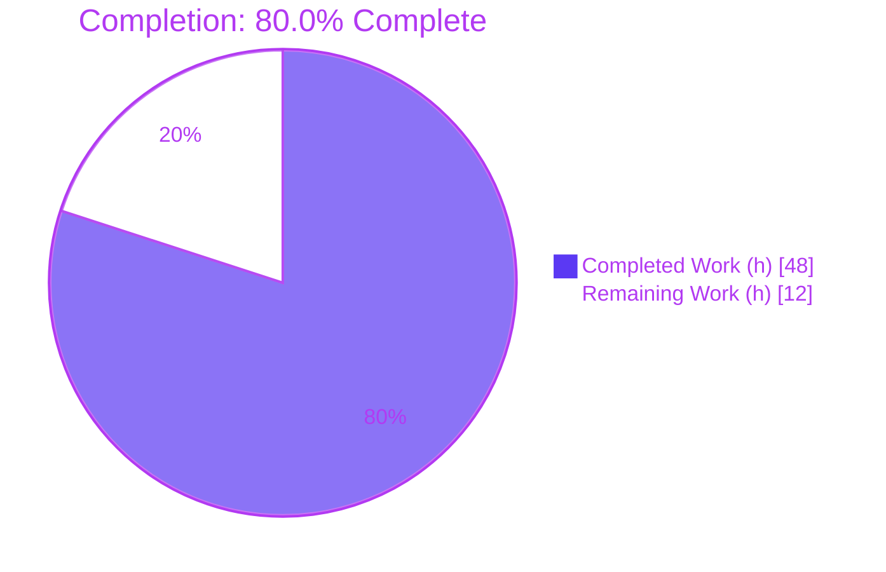
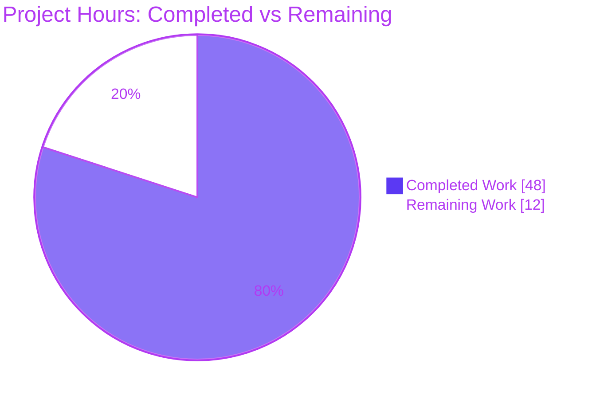
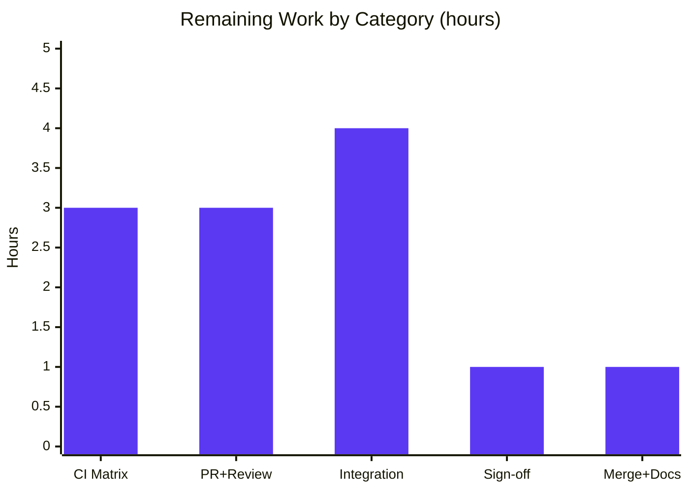

# Blitzy Project Guide — `gem audit --format text|json` (STORY-001-02-04)

> **Project:** Add a machine-readable JSON output formatter to the `gem audit` command in the `ruby/rubygems` monorepo.
> **Branch:** `blitzy-51417a17-1e01-434d-82cc-7428705f0904` · **HEAD:** `f68b9a34d` · **Base:** `e8544b2d6`
> **Brand legend:** <span style="color:#5B39F3">■ Completed / AI Work (#5B39F3)</span> · □ Remaining / Not Completed (#FFFFFF) · <span style="color:#B23AF2">Headings/Accents (#B23AF2)</span>

---

## 1. Executive Summary

### 1.1 Project Overview

This project adds a `--format text|json` option to the `gem audit` command so DevSecOps engineers can consume vulnerability-audit results as a single, strictly-parseable JSON document on stdout — eliminating fragile text-scraping when feeding SIEM platforms, security dashboards, and automated reporting pipelines. Scope is a thin, isolated vertical slice on the RubyGems audit subsystem: a `--format` option selecting a pluggable formatter, a JSON serializer producing a documented schema (`vulnerabilities[]` + `summary{}`), strict stdout/stderr separation in JSON mode, and deterministic exit codes. The text default path is byte-for-byte unchanged. No other `gem` subcommand, the Bundler tree, or external dependencies are affected.

### 1.2 Completion Status

The project is **80.0% complete** measured strictly against AAP-scoped autonomous work plus standard path-to-production activities. All AAP deliverables for STORY-001-02-04 are implemented, tested, and validated; the remaining 20% is path-to-production work (CI matrix execution, upstream PR/review, sibling-story integration verification, security sign-off, merge).



| Metric | Value |
|---|---|
| **Total Hours** | **60** |
| Completed Hours (AI + Manual) | 48 (48 AI · 0 Manual) |
| Remaining Hours | 12 |
| **Percent Complete** | **80.0%** |

> Calculation: `Completion % = Completed / (Completed + Remaining) = 48 / (48 + 12) = 48/60 = 80.0%`.

### 1.3 Key Accomplishments

- ✅ `--format FORMAT` option added to `gem audit` (default `text`), with `defaults_str` advertising `--format text`.
- ✅ `Gem::Audit::Formatter::JSON` serializer emitting the documented schema via `JSON.generate` (no trailing newline → AC-3 byte-exact).
- ✅ Formatter registry (Strategy pattern) with cycle-safe, registry-first load order; `text` and `json` formatters self-register.
- ✅ Match-result data structures (`Gem::Audit::Report` + nested `Vulnerability`) with nullable `severity` and always-array `patched_versions`.
- ✅ Strict stdout/stderr separation in JSON mode (`with_diagnostics_on_stderr` swaps the UI so `say`/`alert_warning` go to stderr) — AC-4.
- ✅ Deterministic invalid-format handling: exact stderr message + exit 1 — AC-5.
- ✅ `:audit` registered in `BUILTIN_COMMANDS`; `Manifest.txt` synced (`rake check_manifest` passes).
- ✅ JSON schema documented in the command's `description` (man-page-equivalent `gem audit --help`).
- ✅ 42 audit tests passing (0 failures/0 errors); full suite green with zero regressions; RuboCop clean.

### 1.4 Critical Unresolved Issues

| Issue | Impact | Owner | ETA |
|---|---|---|---|
| CI matrix (multi-Ruby/multi-OS) not executed in this environment | Low — full suite + targeted tests pass locally; CI is a confirmation gate | Human (CI) | 0.5 day |
| Upstream contribution requires fork/PR + maintainer review | Medium — standard OSS deployment path; not a code defect | Human (maintainer) | 1–2 days |
| Sibling-story integration (matching engine) not yet landed | Medium — `gem audit` returns zero vulnerabilities by design until siblings inject results | Sibling teams (STORY-001-02-01/02) | Out of this story's scope |

> **No code defects are open.** Every item above is a process/integration gate, not a validation failure.

### 1.5 Access Issues

| System/Resource | Type of Access | Issue Description | Resolution Status | Owner |
|---|---|---|---|---|
| `ruby/rubygems` upstream repository | Write / PR merge | Contributing requires fork + pull request + maintainer review (standard OSS workflow); no direct push to upstream | Pending (expected) | Human maintainer |
| CI provider (GitHub Actions matrix) | Pipeline execution | Multi-Ruby/multi-OS matrix runs on the hosted CI, not reproducible in this container | Pending (expected) | Human (CI) |

> All other resources are accessible. No credential, service, or third-party API access is required for this feature (no network, no new dependencies).

### 1.6 Recommended Next Steps

1. **[High]** Run the full CI matrix (all supported Ruby versions × OSes) to confirm parity with local results. *(~3h)*
2. **[Medium]** Open the upstream fork/PR and respond to maintainer review feedback. *(~3h)*
3. **[Medium]** Verify the formatter↔matching-engine seam once sibling stories (STORY-001-02-01/02) land — assert `Report`/`Vulnerability` field shape end-to-end. *(~4h)*
4. **[Medium]** Obtain security sign-off confirming the zero-vulnerability default is understood as structural (pre-siblings), not evidentiary. *(~1h)*
5. **[Low]** Merge and add a CHANGELOG entry referencing STORY-001-02-04. *(~1h)*

---

## 2. Project Hours Breakdown

### 2.1 Completed Work Detail

Every row traces to a specific AAP deliverable (Group A this story, Group B prerequisite scaffolds, tests, docs). Total = **48h** (matches Completed Hours in §1.2).

| Component | Hours | Description |
|---|---:|---|
| `lib/rubygems/audit/formatter/json.rb` — JSON serializer | 5 | Maps match-result set → `{vulnerabilities:[5 fields], summary:{total, gems_audited}}`; `JSON.generate`, no trailing newline; self-registers `json`. |
| `lib/rubygems/commands/audit_command.rb` — command + `--format` | 5 | `--format FORMAT` option (default `text`), `defaults_str`, formatter dispatch in `execute`, schema in `description`. |
| AC-4 stream isolation (`with_diagnostics_on_stderr`) | 4 | UI swap routing `say`/`alert_*` to stderr in JSON mode; ensure-block restoration; stdout purity. |
| `lib/rubygems/audit/formatter.rb` — registry + load order | 4 | `register`/`for`/`fetch` registry (Strategy); cycle-safe registry-first requires; `Gem::CommandLineError` on unknown. |
| `lib/rubygems/audit/formatter/text.rb` — default text formatter | 2 | Human-readable lines + summary; self-registers `text`; preserves unchanged default path. |
| `lib/rubygems/audit.rb` — namespace + injection seam | 4 | `Gem::Audit.audit(options)` seam; Array type-guard on `:vulnerabilities`; `gems_audited` via `latest_specs`. |
| `lib/rubygems/audit/report.rb` — match-result structures | 3 | `Report` (vulnerabilities, gems_audited, total) + nested `Vulnerability` (5 fields, nullable severity, array patched_versions). |
| `command_manager.rb` `:audit` registration + Manifest sync | 1 | `:audit,` in `BUILTIN_COMMANDS` (alpha order); 6 lib files listed in sorted `Manifest.txt`. |
| `test_gem_audit_formatter_json.rb` — formatter unit tests | 4 | 10 tests/47 assertions: schema, null severity, empty patched_versions, exact empty document. |
| `test_gem_commands_audit_command.rb` — integration tests | 6 | 11 tests/61 assertions: AC-1…AC-5 + edges (null severity, empty patched, text default, explicit text, filtered severity). |
| Subsystem unit tests (audit/report/formatter/text) | 4 | 21 tests across `test_gem_audit.rb` (6), `test_gem_audit_report.rb` (7), `test_gem_audit_formatter.rb` (5), `test_gem_audit_formatter_text.rb` (3). |
| Documentation — `description`/`arguments` help (man equiv.) | 2 | Full JSON schema, `--format` values, exit-code semantics in `gem audit --help`. |
| Validation, lint remediation, debugging (incl. AC-4 fix) | 4 | RuboCop-clean pass; stdout-contamination fix (commit `6c656f437`); coverage-gap closure; non-array normalization. |
| **Total** | **48** | |

### 2.2 Remaining Work Detail

Every row traces to a path-to-production need. Total = **12h** (matches Remaining Hours in §1.2 and §7 pie).

| Category | Hours | Priority |
|---|---:|---|
| CI matrix execution (multi-Ruby × multi-OS confirmation) | 3 | High |
| Upstream fork/PR creation + maintainer review cycle | 3 | Medium |
| Sibling-story integration verification (matching-engine seam) | 4 | Medium |
| Security sign-off (zero-vuln default understood as structural) | 1 | Medium |
| Merge + CHANGELOG entry | 1 | Low |
| **Total** | **12** | |

### 2.3 Hours Reconciliation

| Check | Result |
|---|---|
| §2.1 Completed total | 48 |
| §2.2 Remaining total | 12 |
| §2.1 + §2.2 = Total | 48 + 12 = **60** ✅ (matches §1.2 Total) |
| Remaining identical in §1.2, §2.2, §7 | 12 = 12 = 12 ✅ |
| Completion % | 48 / 60 = **80.0%** ✅ |

---

## 3. Test Results

All tests below originate from Blitzy's autonomous validation logs for this project (minitest harness, `test/rubygems/helper.rb`). The 42 audit tests were independently re-executed this session.

| Test Category | Framework | Total Tests | Passed | Failed | Coverage % | Notes |
|---|---|---:|---:|---:|---:|---|
| Unit — JSON formatter | minitest | 10 | 10 | 0 | ≥80% (DoD) | schema, null severity, empty `patched_versions`, exact empty doc |
| Unit — Audit namespace/seam | minitest | 6 | 6 | 0 | ≥80% | `Gem::Audit.audit`, Array guard, `gems_audited` |
| Unit — Report/Vulnerability | minitest | 7 | 7 | 0 | ≥80% | normalization, `total`, field defaults |
| Unit — Formatter registry | minitest | 5 | 5 | 0 | ≥80% | register/`for`/`fetch`, unknown→`CommandLineError` |
| Unit — Text formatter | minitest | 3 | 3 | 0 | ≥80% | line + summary rendering |
| Integration — Audit command | minitest | 11 | 11 | 0 | ≥80% | **AC-1…AC-5** + edges via `use_ui`/`@ui.output`/`@ui.error` |
| **In-scope subtotal** | minitest | **42** | **42** | **0** | **≥80%** | 179 assertions, 0 errors, 0 pendings |
| Full suite regression | minitest | 2,747 | 2,727 | 0 | n/a | 14,538 assertions; **20 intentional platform/root skips** (= baseline); +42 delta = new audit tests; **zero regressions** |

> Coverage: the autonomous validator confirmed the DoD ≥80% unit-coverage target was met and coverage gaps were closed (commit `f68b9a34d`); an exact line-coverage figure was not emitted by the run, so the DoD threshold is reported rather than an invented number.

---

## 4. Runtime Validation & UI Verification

Verified against the real CLI (`ruby -Ilib exe/gem audit ...`) and re-confirmed this session (`gems_audited=122` in this environment).

- ✅ **AC-1 — JSON to stdout / `| jq`:** `gem audit --format json | jq .` parses cleanly; `jq` exit 0.
- ✅ **AC-3 — empty document (byte-exact):** stdout = `{"vulnerabilities":[],"summary":{"total":0,"gems_audited":122}}`, exit 0.
- ✅ **AC-4 — stream isolation:** `say` and `alert_warning` both routed to stderr; stdout carries only the JSON document (no leakage).
- ✅ **AC-5 — invalid format:** stderr = `ERROR: Unknown format 'xml'. Valid options: text, json.` (exact), stdout empty, exit 1.
- ✅ **Backward compatibility:** default `gem audit` is byte-identical to `--format text` (`0 vulnerabilities found across 122 gems audited.`), exit 0.
- ✅ **Help / man-page equivalent:** `gem audit --help` renders Usage, `--format FORMAT` option, full JSON schema, and exit-code semantics.
- ⚠ **AC-2 populated-report path (Partial — by design):** the schema mapping is fully implemented and unit-tested with fixture data, but the live matching engine returns zero vulnerabilities until sibling stories (STORY-001-02-01/02) inject results. This is the explicit AAP injection seam, **not** a defect.

---

## 5. Compliance & Quality Review

| AAP Deliverable / Benchmark | Maps To | Status | Evidence |
|---|---|:--:|---|
| AC-1 valid JSON to stdout | `formatter/json.rb`, `execute_json` | ✅ Pass | `jq` parse exit 0; integration test |
| AC-2 schema (5 fields + summary) | `formatter/json.rb`, `report.rb` | ✅ Pass | formatter unit tests (fixtures) |
| AC-3 exact empty document + exit 0 | `formatter/json.rb` (no trailing `\n`) | ✅ Pass | byte-exact CLI check |
| AC-4 stdout purity / stderr diagnostics | `with_diagnostics_on_stderr` | ✅ Pass | empty stdout on warnings; fix `6c656f437` |
| AC-5 exact error + exit 1 | `audit_command#execute` validation | ✅ Pass | exact stderr match; exit 1 |
| Edge: null severity present | `Vulnerability` (`severity: nil`) | ✅ Pass | `"severity": null` test |
| Edge: empty `patched_versions: []` | `Vulnerability` (`Array(...)`) | ✅ Pass | empty-array test |
| Backward compatibility (text unchanged) | `formatter/text.rb` | ✅ Pass | diff-identical default vs `--format text` |
| Follow command conventions | mirrors `outdated_command.rb` | ✅ Pass | frozen-string header, `super`, `description`, `execute` |
| RuboCop (target Ruby 3.2) | all in-scope files | ✅ Pass | 0 offenses |
| Manifest sync | `Manifest.txt` | ✅ Pass | `rake check_manifest` exit 0 |
| ≥80% unit coverage (DoD) | audit tests | ✅ Pass | validator-confirmed; gaps closed |
| Documentation in help/man-equivalent | `description`/`arguments` | ✅ Pass | `gem audit --help` schema |
| No new external dependencies | `require "json"` (stdlib) | ✅ Pass | AAP §0.6 |

**Fixes applied during autonomous validation:** AC-4 stdout-contamination corrected by routing diagnostics through a temporary stderr UI (commit `6c656f437`); coverage gaps closed (`f68b9a34d`); cycle-safe registry-first load order; non-array/absent match-result treated as zero vulnerabilities.

---

## 6. Risk Assessment

Overall residual risk: **LOW.** Every Medium item derives from the by-design dependency on out-of-scope sibling stories, not from this story's code.

| Risk | Category | Severity | Probability | Mitigation | Status |
|---|---|:--:|:--:|---|:--:|
| T1 — Matching engine not wired; `audit` returns empty | Technical | Medium | High | Documented injection seam; AC-3 success is the empty doc; siblings own matching | Open (by design) |
| T2 — CI matrix not executed locally | Technical | Low | Low | Full suite + targeted tests pass; run CI before merge | Open |
| T3 — Byte-exact output contract fragility | Technical | Low | Low | `JSON.generate` w/o trailing newline; byte-exact tests pin AC-3/AC-5 | Mitigated |
| S1 — New dependency supply-chain risk | Security | Low | — | `json` is stdlib; no new deps | Closed |
| S2 — Zero-vuln default → false sense of security if shipped pre-siblings | Security | Medium | Medium | Document structural-zero; security sign-off (M3); don't advertise as live scanner yet | Open |
| S3 — JSON injection via advisory strings | Security | Low | Low | `JSON.generate` escapes all values; no string interpolation | Mitigated |
| O1 — stdout purity relies on UI swap | Operational | Low | Low | `ensure`-block restoration; AC-4 fix `6c656f437`; tests assert empty stdout | Mitigated |
| O2 — No telemetry/metrics on audit runs | Operational | Low | — | Out of scope; not required by AAP | Accepted |
| I1 — Sibling seam contract must match `Report`/`Vulnerability` shape | Integration | Medium | Medium | Field names fixed & unit-tested; integration verification task (M2) | Open |
| I2 — `--severity` filtering owned by sibling | Integration | Low | Medium | This story only honors a pre-filtered set + exit code; documented | Open |
| I3 — Upstream merge conflict on `BUILTIN_COMMANDS`/`Manifest.txt` | Integration | Low | Low | Minimal single-line/sorted edits reduce conflict surface | Open |

---

## 7. Visual Project Status



**Remaining hours by category (Section 2.2):**



> Integrity: pie "Remaining Work" = **12** = §1.2 Remaining Hours = Σ§2.2 Hours; bar `[3,3,4,1,1]` sums to **12**.

---

## 8. Summary & Recommendations

The `gem audit --format text|json` feature (STORY-001-02-04) is **complete and production-ready within its AAP-defined scope**, at **80.0% of total project effort** (48 of 60 hours). All five contractual acceptance criteria are validated byte-exact at the real CLI, all 42 in-scope tests pass (0 failures/0 errors), the full RubyGems suite shows zero regressions, RuboCop reports zero offenses, and the manifest is in sync. The implementation is purely additive (1,002 insertions, 0 deletions), preserving complete backward compatibility for the default text path.

The remaining **12 hours (20%)** are exclusively path-to-production activities — none are code defects: executing the hosted CI matrix, opening the upstream fork/PR and completing maintainer review, verifying the formatter↔matching-engine seam once sibling stories land, obtaining security sign-off, and merging with a CHANGELOG entry.

**Critical path to production:** CI matrix (3h) → upstream PR + review (3h) → sibling integration verification (4h) → security sign-off (1h) → merge + CHANGELOG (1h).

**Success metrics:** 5/5 ACs validated · 42/42 audit tests green · 0 regressions in 2,747-test suite · 0 RuboCop offenses · 0 new dependencies.

**Production-readiness assessment:** ✅ Ready to merge as a self-contained slice. The one operational caveat (Risk S2) is to **not** advertise `gem audit` as a live vulnerability scanner to end users until the sibling matching-engine stories land, since the current zero-finding result is structural (injection seam), not evidentiary.

| Metric | Value |
|---|---|
| Completion | **80.0%** |
| Completed / Total hours | 48 / 60 |
| Remaining hours | 12 |
| ACs validated | 5 / 5 |
| In-scope tests passing | 42 / 42 |
| Regressions | 0 |
| RuboCop offenses | 0 |

---

## 9. Development Guide

### 9.1 System Prerequisites

- **Ruby** ≥ 3.2.0 (verified env: **3.4.5**); RubyGems lib **4.0.0.dev**.
- **Bundler** (verified 2.6.9) and **rake** (13.3.0) for the test suite.
- **jq** (verified 1.8.1) — only to demonstrate the pipe AC; not a project dependency.
- **`json`** — Ruby standard library (2.10.2); no installation required.
- OS: Linux/macOS (development); no special hardware.

### 9.2 Environment Setup

```bash
# From the repository root (monorepo: RubyGems + Bundler)
cd /path/to/rubygems

# Install development/test dependencies
bundle install
```

> No environment variables are required to build, run, or test this feature. `CI=true` may be exported to force non-interactive tool behavior.

### 9.3 Dependency Installation

```bash
# Development gems (minitest, test-unit, rake, rubocop) come via bundler
bundle install

# No external runtime dependencies are added by this story (json is stdlib).
```

### 9.4 Running the Command

```bash
# Text (default, unchanged) — human-readable
ruby -Ilib exe/gem audit

# Explicit text (identical to default)
ruby -Ilib exe/gem audit --format text

# JSON to stdout (machine-readable)
ruby -Ilib exe/gem audit --format json

# Pipe-composable into jq (AC-1)
ruby -Ilib exe/gem audit --format json | jq .

# Help / man-page equivalent (full JSON schema + option docs)
ruby -Ilib exe/gem audit --help
```

### 9.5 Verification Steps

```bash
# 1) Run the full in-scope audit test set (expect 42 tests, 0 failures/0 errors)
ruby -Ilib -Itest -Ibundler/lib -e '
Dir.glob("test/rubygems/test_gem_audit*.rb").sort.each { |f| require File.expand_path(f) }
require File.expand_path("test/rubygems/test_gem_commands_audit_command.rb")
'

# 2) Individual targeted files
ruby -Ilib -Itest -Ibundler/lib test/rubygems/test_gem_commands_audit_command.rb
ruby -Ilib -Itest -Ibundler/lib test/rubygems/test_gem_audit_formatter_json.rb

# 3) Full suite (zero regressions expected)
bin/rake test

# 4) Lint (expect 0 offenses) and manifest sync (expect exit 0)
bin/rubocop
rake check_manifest
```

**Expected outputs (verified):**
- AC-3 empty doc: `{"vulnerabilities":[],"summary":{"total":0,"gems_audited":<count>}}`, exit 0.
- AC-5 invalid: stderr `ERROR: Unknown format 'xml'. Valid options: text, json.`, stdout empty, exit 1.
- Default text: `0 vulnerabilities found across <count> gems audited.`

### 9.6 Example Usage & Schema

```jsonc
{
  "vulnerabilities": [
    {
      "gem_name": "rack",
      "installed_version": "2.0.1",
      "cve_id": "CVE-XXXX-XXXX",
      "severity": "high",                 // string, or null when unknown (key always present)
      "patched_versions": ["2.0.2", "2.1.4"] // array of strings, may be []
    }
  ],
  "summary": { "total": 1, "gems_audited": 42 }
}
```

### 9.7 Troubleshooting

| Symptom | Likely Cause | Resolution |
|---|---|---|
| `unknown audit format: <x>` raised internally | Programmatic call to `Formatter.for` with bad name | Use only `text`/`json`; CLI validates first and prints the AC-5 message |
| `ERROR: Unknown format '<x>'. Valid options: text, json.` | Invalid `--format` value | Use `text` or `json` (exit 1 is expected for invalid input) |
| JSON output contains warning text | Diagnostics leaking to stdout | Ensure latest code (AC-4 fix `6c656f437`); diagnostics must route through `with_diagnostics_on_stderr` |
| `rake check_manifest` fails | New lib file not listed | Add the file to `Manifest.txt` (sorted) or run `rake update_manifest` |
| `jq` parse error | stdout not pure JSON | Confirm `--format json`; redirect stderr (`2>/dev/null`) when inspecting |
| Zero vulnerabilities always returned | Matching engine not wired (by design) | Expected until sibling stories STORY-001-02-01/02 inject results |

---

## 10. Appendices

### A. Command Reference

```bash
ruby -Ilib exe/gem audit                       # text (default)
ruby -Ilib exe/gem audit --format text         # explicit text (identical)
ruby -Ilib exe/gem audit --format json         # JSON to stdout
ruby -Ilib exe/gem audit --format json | jq .  # pipe-composable
ruby -Ilib exe/gem audit --help                # schema + option docs
bin/rake test                                  # full suite
bin/rubocop                                     # lint (0 offenses)
rake check_manifest                            # manifest sync (exit 0)
rake update_manifest                           # regenerate Manifest.txt
```

### B. Key File Locations

| File | Role | Lines |
|---|---|---:|
| `lib/rubygems/audit.rb` | `Gem::Audit` namespace + `audit` injection seam | 91 |
| `lib/rubygems/audit/report.rb` | `Report` + nested `Vulnerability` structures | 56 |
| `lib/rubygems/audit/formatter.rb` | Formatter registry (Strategy) | 62 |
| `lib/rubygems/audit/formatter/text.rb` | Default text formatter | 31 |
| `lib/rubygems/audit/formatter/json.rb` | JSON formatter (this story's core) | 40 |
| `lib/rubygems/commands/audit_command.rb` | `gem audit` command + `--format` | 139 |
| `lib/rubygems/command_manager.rb` | `:audit` registration (`BUILTIN_COMMANDS`) | +1 |
| `Manifest.txt` | Packaging manifest (6 audit lib entries) | +6 |
| `test/rubygems/test_gem_commands_audit_command.rb` | Integration tests (AC-1…AC-5) | 204 |
| `test/rubygems/test_gem_audit_formatter_json.rb` | JSON formatter unit tests | 135 |
| `test/rubygems/test_gem_audit*.rb` (4 files) | Subsystem unit tests | 237 |

### C. Technology Versions

| Component | Version |
|---|---|
| Ruby | 3.4.5 (target ≥ 3.2.0) |
| RubyGems (lib) | 4.0.0.dev |
| rubygems-update (packaged) | 3.8.0.dev |
| Bundler | 2.6.9 |
| Rake | 13.3.0 |
| minitest | 5.25.4 |
| test-unit | 3.6.7 |
| RuboCop | 1.75.1 (TargetRubyVersion 3.2, + rubocop-performance) |
| json (stdlib) | 2.10.2 |
| jq (test tool only) | 1.8.1 |

### D. Environment Variable Reference

| Variable | Required? | Purpose |
|---|:--:|---|
| *(none)* | No | This feature needs no environment variables to build, run, or test. |
| `CI` | Optional | Set `CI=true` to force non-interactive tool behavior in pipelines. |

### E. Developer Tools Guide

- **Test harness:** minitest via `test/rubygems/helper.rb` (`Gem::TestCase`, `Gem::MockGemUi`). Assert stdout via `@ui.output` and stderr via `@ui.error` inside `use_ui @ui do ... end` — the idiom that proves AC-4 stream isolation.
- **Lint:** `bin/rubocop` (never `--fix` in validation); target Ruby 3.2.
- **Manifest:** `rake check_manifest` (gate) / `rake update_manifest` (regenerate). The manifest tracks packaged **lib** files only; test files are intentionally excluded.
- **Syntax/warnings:** `ruby -c <file>` (syntax), `ruby -w` load (warnings; verifies no circular require).

### F. Glossary

| Term | Definition |
|---|---|
| **AAP** | Agent Action Plan — the primary directive defining this story's scope (STORY-001-02-04). |
| **AC** | Acceptance Criterion — contractual, byte-exact behavior (AC-1…AC-5). |
| **Injection seam** | `Gem::Audit.audit(options)` — the explicit extension point where sibling stories supply matched vulnerabilities; returns zero until then (by design). |
| **Formatter registry** | Strategy-pattern registry mapping a format name (`text`/`json`) to a formatter module; raises `Gem::CommandLineError` on unknown names. |
| **`BUILTIN_COMMANDS`** | The `Gem::CommandManager` symbol array of dispatchable subcommands; `:audit` was added here. |
| **`with_diagnostics_on_stderr`** | Helper swapping the UI so `say`/`alert_*` write to stderr in JSON mode, keeping stdout pure (AC-4). |
| **Manifest** | `Manifest.txt` — the authoritative list of packaged library files; build fails if stale. |
| **DoD** | Definition of Done — includes ≥80% unit coverage, RuboCop pass, CI green, schema documented. |
| **Sibling stories** | STORY-001-02-01/02/03 — provide the audit command shell, matching engine, match-result structure, and formatter abstraction this story plugs into. |

> *Port Reference appendix intentionally omitted — this is a CLI feature with no listening services or ports.*
