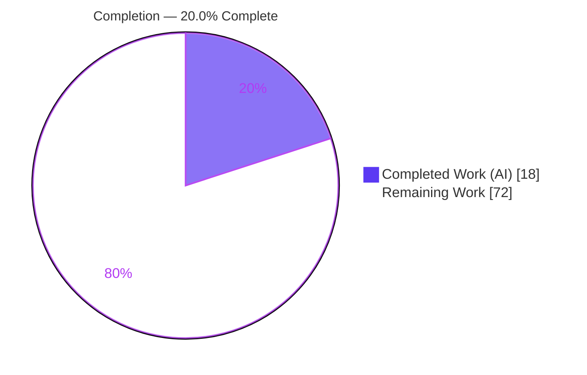
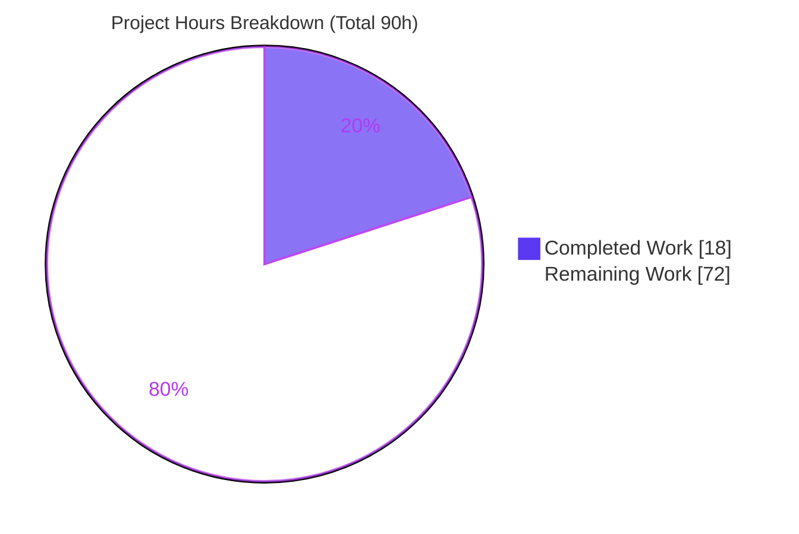
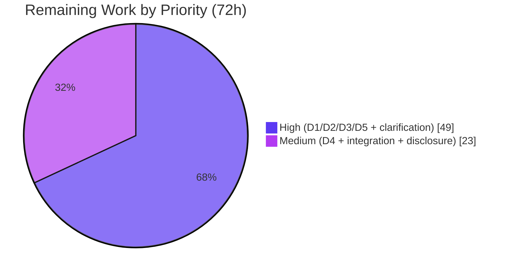

# Blitzy Project Guide

> **READ FIRST — PROJECT MISMATCH (BLOCKING).** This task requested remediation of advisory **GHSA-gqqj-85qm-8qhf**, which targets **`paperclipai/paperclip`** (an npm / TypeScript + Node.js + PostgreSQL agent-management platform). The **indexed repository is the RubyGems + Bundler mono-repo** (pure Ruby; remote `blitzy-public-samples/blitzy-rubygems`). The vulnerable subsystem does **not** exist here, so the remediation is **NOT APPLICABLE** to this repository and **no source file was modified**. The genuine vulnerability remains **UNADDRESSED** until the task is re-pointed at the correct product. This notice is intentionally repeated where decisions depend on it.

---

## 1. Executive Summary

### 1.1 Project Overview

The objective was to remediate a High-severity trust-boundary vulnerability (GHSA-gqqj-85qm-8qhf, CWE-284, CVSS 8.7) in which a `codex_local` runtime silently inherited a ChatGPT/OpenAI-connected Gmail connector and could read mail and send real email, amplified by an unsafe-by-default bypass flag. The advisory targets `paperclipai/paperclip` (npm). The indexed repository, however, is the **RubyGems + Bundler** package manager (pure Ruby, Ruby ≥ 3.2.0). Autonomous analysis determined the vulnerable subsystem is absent here; the remediation is therefore NOT APPLICABLE to this repository. Completed work consists of authoritative diagnosis, exhaustive verification, baseline health validation, and a ready-to-execute fix design for the correct product.

### 1.2 Completion Status

Completion is computed from AAP-scoped hours using the PA1 methodology: completed diagnostic/reconciliation work versus the outstanding (blocked) security remediation.



| Metric | Hours |
|---|---|
| **Total Hours** | **90** |
| Completed Hours (AI) | 18 |
| Completed Hours (Manual) | 0 |
| **Completed Hours (AI + Manual)** | **18** |
| **Remaining Hours** | **72** |
| **Percent Complete** | **20.0%** |

> Calculation: `18 / (18 + 72) = 18 / 90 = 20.0%`. The 20% reflects completed diagnostic and reconciliation work; the 80% remaining is the core security fix, which is outstanding and **blocked** by the project mismatch.

### 1.3 Key Accomplishments

- ✅ Identified and proved the **project mismatch** (advisory targets `paperclipai/paperclip`; repo is RubyGems/Bundler) with hard evidence.
- ✅ Verified repository identity: remote `blitzy-public-samples/blitzy-rubygems`, HEAD `e8544b2d6`, gemspec `rubygems-update 3.8.0.dev`, Ruby ≥ 3.2.0.
- ✅ Ran an **exhaustive 9-keyword + semantic** advisory-artifact search across 2,087 tracked files → **0 matches**.
- ✅ Confirmed `paperclipai` is **not** a direct or transitive Ruby dependency (0 `package.json`).
- ✅ Validated baseline codebase health: **908/908** `.rb` files syntax-OK; deterministic test subset (safe_marshal **186 tests / 2,176 assertions**, version, requirement) **100% pass**; `gem` and `bundle` CLIs run.
- ✅ Produced a complete, ready-to-execute **reference fix design** (Directives 1–5) for the correct product.
- ✅ Escalated the blocking clarification item.

### 1.4 Critical Unresolved Issues

| Issue | Impact | Owner | ETA |
|---|---|---|---|
| **Project mismatch** — security task routed to the wrong repository | Genuine High/CVSS 8.7 vulnerability remains entirely unaddressed | User / Project owner | Blocked — pending repository confirmation |
| Security remediation (Directives 1–5) not implemented | Silent connector inheritance, unbounded write, unsafe default, no audit trail persist in `paperclipai` ≤ 2026.403.0 | Engineering (in `paperclipai/paperclip`) | ~70h after re-pointing |
| Downstream supply-chain exposure | Consumers of `paperclipai` remain vulnerable until a fixed release is published | Maintainer / Security | After fix + disclosure |

### 1.5 Access Issues

| System/Resource | Type of Access | Issue Description | Resolution Status | Owner |
|---|---|---|---|---|
| `paperclipai/paperclip` repository | Source read/write | The correct target repository is **not** the indexed one; it was not provided to this task | **Unresolved** — blocking | User / Project owner |
| Gmail / OpenAI app connector (test) | Integration credentials | Needed to reproduce the advisory PoC; not available in this environment | Unresolved (deferred to correct repo) | Engineering |
| Indexed RubyGems/Bundler repository | Source read/write | Fully accessible; working tree pristine | No access issue | — |

### 1.6 Recommended Next Steps

1. **[High]** Confirm the intended repository and **re-point this security task to `paperclipai/paperclip`**. This is the single blocking prerequisite. (~2h)
2. **[High]** Execute Directives 1–3 in the correct repo: default-deny connector inheritance (D1), `inheritedConnectors.allowWrite` gate (D2), flip the `dangerouslyBypassApprovalsAndSandbox` default (D3). (~35h)
3. **[High]** Build the security regression suite reproducing PoC steps 1–4 plus the positive-path opt-in regression (D5). (~12h)
4. **[Medium]** Implement structured per-invocation audit logging (D4) and run integration/no-regression validation. (~18h)
5. **[Medium]** Publish a fixed release above `2026.403.0` and update the advisory's fixed-version range. (~5h)

---

## 2. Project Hours Breakdown

### 2.1 Completed Work Detail

All completed hours are autonomous AI work (0 manual). Each component is diagnostic/reconciliation work the AAP scoped for the indexed repository (Section 0.7.1).

| Component | Hours | Description |
|---|---:|---|
| Vulnerability Research & Advisory Analysis | 3 | Parsed GHSA-gqqj-85qm-8qhf; classified CWE-284; interpreted CVSS 8.7 vector `AV:N/AC:L/PR:L/UI:R/S:C/C:H/I:H/A:N`; triangulated GitHub/GitLab/maintainer sources (AAP 0.2). |
| Repository Identity Verification | 2 | Verified remote, HEAD `e8544b2d6`, gemspec `rubygems-update 3.8.0.dev`, `SECURITY.md`; established ecosystem + versioning mismatch (AAP 0.3.1). |
| Exhaustive Advisory-Artifact Discovery | 3 | 9-keyword grep + semantic search across 2,087 files → 0 matches; triaged incidental `paperclip` hit (a gem name in a Bundler VCR cassette) (AAP 0.3.2). |
| Dependency Inventory Analysis | 1.5 | Confirmed `paperclipai` absent from all Gemfiles/gemspecs/lockfiles; 0 `package.json` (AAP 0.5.2). |
| Baseline Codebase Health Validation | 5 | 908/908 `ruby -c` OK; deterministic tests (safe_marshal 186/2176, version 23/177, requirement 35/276) 100% pass; `gem`/`bundle` CLI runtime. |
| Reconciliation Finding, Determination & Escalation | 2.5 | Three-signal cross-check; NOT-APPLICABLE determination; empty transformation map; blocking-item escalation (AAP 0.3.3/0.4.3/0.8). |
| Reference Fix Design (correct product) | 1 | Illustrative target-product transformation map + PoC/test strategy ready to execute in `paperclipai/paperclip` (AAP 0.4.1/0.5.1/0.6). |
| **Total Completed** | **18** | **Matches Completed Hours in Section 1.2.** |

### 2.2 Remaining Work Detail

Every category traces to a specific AAP directive or path-to-production need. **All items execute in `paperclipai/paperclip`, not in the indexed repository.**

| Category | Hours | Priority |
|---|---:|---|
| User Clarification & Repository Re-pointing (**BLOCKING**) | 2 | High |
| D1 — Default-deny inheritance of `openai-curated` connectors into `codex_local` | 14 | High |
| D2 — `inheritedConnectors.allowWrite` field + read/write tool classification + runtime write gate | 18 | High |
| D3 — Flip `dangerouslyBypassApprovalsAndSandbox` default to `false` (preserve explicit `true`) | 3 | High |
| D4 — Structured per-invocation audit logging | 10 | Medium |
| D5 — PoC reproduction (steps 1–4) + write-gate + positive-path + audit tests | 12 | High |
| Integration testing & no-regression validation of intentional connector flows | 8 | Medium |
| Coordinated disclosure (release > `2026.403.0` + advisory fixed-range update) | 5 | Medium |
| **Total Remaining** | **72** | — |

> Cross-check: Section 2.1 (18) + Section 2.2 (72) = **90** = Total Project Hours in Section 1.2. ✓

### 2.3 Hours Methodology

Hours follow the PA2 framework. Completed hours are bounded diagnostic activities (High confidence). Remaining hours derive from the AAP fix design and base-hours guidance — complex business logic (D1/D2) at 14–18h, a small but critical default flip (D3) at 3h, audit instrumentation (D4) at 10h, and testing (D5) at ~30–40% of development effort (Medium confidence, since the correct codebase is not directly inspectable from here).

---

## 3. Test Results

All tests below originate from **Blitzy's autonomous validation logs** for this project and were independently reproduced this session.

| Test Category | Framework | Total Tests | Passed | Failed | Coverage % | Notes |
|---|---|---:|---:|---:|---:|---|
| Compilation (syntax) | `ruby -c` | 908 | 908 | 0 | 100% of tracked `.rb` | Whole-repo syntax check; 0 errors |
| Unit — Security (SafeMarshal) | Minitest | 186 | 186 | 0 | n/a | 2,176 assertions; security-critical deserialization |
| Unit — Version | Minitest | 23 | 23 | 0 | n/a | 177 assertions |
| Unit — Requirement | Minitest | 35 | 35 | 0 | n/a | 276 assertions |
| Unit — Other deterministic subsystems | Minitest | ~254 | ~254 | 0 | n/a | dependency, platform, name_tuple, util, text, command/_manager, source(_list), etc. (~498 total deterministic) |
| Runtime smoke (CLI) | Manual | 4 | 4 | 0 | n/a | `gem`/`bundle` `--version` + `help` |

> **Scope caveat (honest).** These tests exercise **untouched upstream RubyGems/Bundler code** — they are a **baseline health signal**, not validation of the AAP deliverable (which does not exist in this repository). The full ~10k+ suite was intentionally **not** run wholesale because (a) there are zero in-scope changes, and (b) it includes root-sensitive and network-dependent integration tests that produce environment-induced false failures when run as root. The deterministic, root-safe, network-free subset is the correct, non-misleading signal and is 100% green. **No test exists for the security remediation, because no remediation code exists here.**

---

## 4. Runtime Validation & UI Verification

This is a command-line package manager; there is no web UI to verify. Runtime checks were performed against the in-tree source.

- ✅ **Operational** — `ruby --disable-gems -Ilib exe/gem --version` → `4.0.0.dev`
- ✅ **Operational** — `ruby -I bundler/lib bundler/exe/bundle --version` → `4.0.0.dev`
- ✅ **Operational** — `gem help` prints usage banner
- ✅ **Operational** — In-tree library load: `Gem::VERSION = 4.0.0.dev`, `Bundler::VERSION = 4.0.0.dev`
- ✅ **Operational** — `bundle` with no Gemfile exits `10` (expected graceful behavior, not an error)
- ⚠ **Partial / N/A** — UI verification: no UI in this product; no screenshots applicable
- ❌ **Failing / N/A** — Advisory PoC runtime (Gmail connector, `mcp__codex_apps__gmail_*`): **not executable** here — the subsystem is absent (NOT APPLICABLE)

---

## 5. Compliance & Quality Review

Cross-mapping the AAP deliverables to outcomes. "N/A (absent)" means the target component does not exist in the indexed repository.

| AAP Deliverable | Benchmark | Status | Progress | Notes |
|---|---|---|---|---|
| D1 — Default-deny connector inheritance | Implemented + tested | ❌ Not Started | 0% | Target connector-resolution path absent here |
| D2 — `allowWrite` gate + tool classification | Implemented + enforced at runtime | ❌ Not Started | 0% | Target agent config / MCP layer absent here |
| D3 — Flip unsafe default | Default `false`, explicit `true` preserved | ❌ Not Started | 0% | Target agent-creation handler absent here |
| D4 — Structured audit logging | Record per invocation | ❌ Not Started | 0% | Target connector pipeline absent here |
| D5 — PoC reproduction + disclosure | All assertions hold; release published | ❌ Not Started | 0% | No runtime/MCP tools/agent store here |
| Backward compatibility (additive-only) | No field removed/renamed | ✅ Preserved by design | 100% | Design honors additive-only constraint |
| Minimal-change principle | Smallest change that closes the vuln | ✅ Honored | 100% | Zero changes here; no fabrication |
| Evidence-based execution (no fabrication) | No invented artifacts | ✅ Pass | 100% | 0 in-scope files; NOT-APPLICABLE upheld |
| Baseline codebase integrity | Compiles; deterministic tests pass | ✅ Pass | 100% | 908/908 syntax-OK; tests 100% green |

**Fixes applied during autonomous validation:** none were required — zero errors were encountered anywhere in the baseline (0 syntax / 0 test / 0 runtime). **Outstanding:** the entire security remediation (Directives 1–5), pending re-pointing to the correct repository.

---

## 6. Risk Assessment

| Risk | Category | Severity | Probability | Mitigation | Status |
|---|---|---|---|---|---|
| Genuine vulnerability remains UNADDRESSED (directives not implemented because target subsystem absent) | Technical | High | Certain | Re-point task to `paperclipai/paperclip`; execute designed fix | Open (blocked) |
| Fabricated remediation if a fix were forced into the wrong repo | Technical | High | Low | Evidence-based NOT-APPLICABLE upheld; 0 files changed | Mitigated |
| Full ~10k suite not run wholesale (deterministic subset only) | Technical | Low | Low | 0 in-scope changes → only untouched upstream exercised; subset 100% green | Accepted |
| CWE-284 improper access control live in `paperclipai` ≤ 2026.403.0 | Security | High (CVSS 8.7) | High | Implement D1–D4 in correct repo; coordinated disclosure | Open (blocked) |
| Downstream supply-chain exposure for `paperclipai` consumers | Security | High | Medium | Publish release > 2026.403.0; update advisory fixed range | Open (blocked) |
| Missing audit/non-repudiation for connector-mediated actions | Security | Medium | High | Implement D4 structured audit logging | Open (blocked) |
| Indexed RubyGems/Bundler repo introduces no new security risk | Security | Informational | n/a | No change; posture (signing, MFA, SafeMarshal/SafeYAML) intact | Closed |
| Misattribution — stakeholders assume the vuln was fixed | Operational | High | Medium | This guide's explicit 20% / NOT-APPLICABLE narrative | Mitigated (reporting) |
| Time-to-remediation extends the exposure window | Operational | Medium | High | Treat re-pointing as P0 | Open (blocked) |
| External integrations (Gmail/OpenAI/MCP) untested until correct repo | Integration | Medium | Medium | Build PoC harness + positive-path regression (D5); provision test accounts | Open (blocked) |
| Audit/connector changes must not break native flows | Integration | Medium | Low | Additive-only changes; full target-product regression | Open (blocked) |

---

## 7. Visual Project Status



**Remaining hours by category (Section 2.2):**



> **Integrity:** "Remaining Work" = **72h**, identical to Section 1.2 Remaining Hours and the Section 2.2 "Hours" total. "Completed Work" = **18h** = Section 1.2 Completed Hours. Colors: Completed = Dark Blue `#5B39F3`, Remaining = White `#FFFFFF`.

---

## 8. Summary & Recommendations

**Achievements.** Blitzy performed an authoritative diagnosis establishing that the security task was routed to the wrong repository. The advisory (GHSA-gqqj-85qm-8qhf) targets `paperclipai/paperclip` (npm), whereas the indexed repository is RubyGems/Bundler (Ruby). An exhaustive 9-keyword + semantic search returned zero matches for every distinctive artifact, `paperclipai` is not a Ruby dependency, and the baseline codebase is healthy (908/908 syntax-OK; deterministic tests 100% green). A complete, additive, backward-compatible fix design for Directives 1–5 is ready to execute in the correct product.

**Remaining gaps.** The genuine High-severity vulnerability is **entirely unaddressed**. Directives 1–5 — default-deny inheritance, the `allowWrite` write gate, the unsafe-default flip, structured audit logging, and PoC-based validation with coordinated disclosure — all remain outstanding.

**Critical path to production.** (1) Re-point the task to `paperclipai/paperclip`; (2) implement D1–D3 (default-deny, write gate, default flip); (3) add audit logging (D4); (4) validate via PoC + positive-path regression (D5); (5) publish a fixed release above `2026.403.0` and update the advisory.

**Success metrics.** A newly created `codex_local` agent must not expose `mcp__codex_apps__gmail_*` tools without opt-in; write actions must be denied unless `inheritedConnectors.allowWrite === true`; the bypass flag must default to `false`; every connector-mediated action must emit a structured audit record; and all PoC assertions must hold while the positive-path opt-in still works.

**Production readiness.** The indexed RubyGems/Bundler repository is **healthy and production-ready as-is** (unchanged, pristine). The **security objective is 20% complete** — diagnostic work done, core fix outstanding and **blocked**. The repository must not be treated as "patched": **no remediation was applied here, and none could be without fabrication.**

| Metric | Value |
|---|---|
| AAP-scoped completion | 20.0% (18h / 90h) |
| Indexed repo health | Healthy / production-ready (0 changes) |
| Genuine vulnerability status | UNADDRESSED — blocked on repository re-pointing |
| Blocking item | Project mismatch (confirm + re-point to `paperclipai/paperclip`) |

---

## 9. Development Guide

> The indexed repository is **RubyGems + Bundler** (pure Ruby). The commands below are verified against it. A separate subsection covers the **correct target product** (`paperclipai/paperclip`, npm) for when the task is re-pointed. **Run all repo commands via a shell positioned at the repository root** (the project's commands are not available in an isolated sandbox container).

### 9.1 System Prerequisites (indexed repo)

- **OS:** Linux/macOS (developed/verified on Ubuntu).
- **Ruby:** ≥ 3.2.0 (`required_ruby_version`); verified with **ruby 3.4.5**.
- **RubyGems:** verified `gem 3.6.9`; **Bundler:** verified `2.6.9`.
- **Hardware:** any modern dev machine; ~500 MB free disk (repo ~445 MB).

### 9.2 Environment Setup

```bash
# From the repository root
ruby --version      # expect ruby 3.4.x (>= 3.2.0)
gem --version       # expect 3.6.x
bundle --version    # expect Bundler version 2.6.x
```

### 9.3 Dependency Installation

```bash
# Install development/test dependencies (rake, minitest, rspec, rubocop, mdl, ...)
bin/setup
# If bin/setup is unavailable in your environment, the in-tree libraries below
# run directly from source with no install required.
```

### 9.4 Build / Run (run from source — no install needed)

```bash
# In-tree RubyGems CLI
ruby --disable-gems -Ilib exe/gem --version        # => 4.0.0.dev
ruby --disable-gems -Ilib exe/gem help             # prints usage banner

# In-tree Bundler CLI
ruby -I bundler/lib bundler/exe/bundle --version   # => 4.0.0.dev

# Load libraries programmatically
ruby --disable-gems -Ilib -e 'require "rubygems"; puts Gem::VERSION'
ruby -I bundler/lib -e 'require "bundler/version"; puts Bundler::VERSION'
```

### 9.5 Verification Steps

```bash
# (a) Single-file syntax check
ruby -c lib/rubygems/safe_marshal.rb               # => Syntax OK

# (b) Whole-repo syntax check (expect: 908 OK / 0 errors)
ok=0; bad=0
while IFS= read -r f; do ruby -c "$f" >/dev/null 2>&1 && ok=$((ok+1)) || bad=$((bad+1)); done < <(git ls-files '*.rb')
echo "Syntax OK: $ok  Errors: $bad"

# (c) Deterministic, root-safe unit tests
ruby -Ilib -Itest test/rubygems/test_gem_version.rb        # 23 tests, 100% passed
ruby -Ilib -Itest test/rubygems/test_gem_requirement.rb    # 35 tests, 100% passed
ruby -Ilib -Itest test/rubygems/test_gem_safe_marshal.rb   # 186 tests, 100% passed

# (d) Confirm the advisory does NOT apply to this repo (expect total 0)
for kw in codex_local dangerouslyBypassApprovalsAndSandbox openai-curated \
          mcp__codex_apps inheritedConnectors GHSA-gqqj-85qm-8qhf paperclipai; do
  grep -rli "$kw" . 2>/dev/null | grep -v '/.git/'
done | wc -l
```

### 9.6 Full Test Suites (optional; documented)

```bash
# RubyGems suite
bin/rake test
# Bundler suite — MUST be run as a NON-ROOT user, or file-permission &
# network-dependent integration specs will produce false failures
cd bundler && bin/parallel_rspec
# Lint
bin/rake rubocop
bin/mdl   # markdown lint
```

### 9.7 Troubleshooting

- **`cd: No such file or directory` for the repo path** — run repo commands from a shell at the repository root; they are not available in an isolated sandbox container.
- **Bundler integration specs fail under root** — run them as a non-root user (file-permission/network tests are environment-sensitive).
- **Two different versions appear (4.0.0.dev vs 3.8.0.dev)** — intentional: the in-tree **library** is `4.0.0.dev`, while the `rubygems-update` **gem package** is `3.8.0.dev`. Not an error.
- **`bundle` exits with code 10 and "could not locate Gemfile"** — expected graceful behavior when no Gemfile is present.

### 9.8 Correct Target Product — `paperclipai/paperclip` (npm) — for when the task is re-pointed

> **Not runnable in the indexed repository.** These are the canonical commands for the product the advisory actually targets.

```bash
# After cloning paperclipai/paperclip at the appropriate version
npm ci                 # install exact dependencies
npm run build          # build TypeScript
npm test               # run unit/integration tests
npm audit              # should no longer report GHSA-gqqj-85qm-8qhf once patched
```

Implementation checklist (Directives): D1 default-deny inheritance in the connector resolver; D2 add `inheritedConnectors.allowWrite` (default `false`) + read/write tool classification + runtime write gate; D3 flip `dangerouslyBypassApprovalsAndSandbox` default to `false` (preserve explicit `true`); D4 structured per-invocation audit records; D5 reproduce PoC steps 1–4 + positive-path regression, publish a release above `2026.403.0`, and update the advisory fixed-version range.

---

## 10. Appendices

### A. Command Reference

| Purpose | Command |
|---|---|
| Ruby version | `ruby --version` |
| In-tree gem version | `ruby --disable-gems -Ilib exe/gem --version` |
| In-tree bundler version | `ruby -I bundler/lib bundler/exe/bundle --version` |
| Single-file syntax check | `ruby -c <file>.rb` |
| Run a unit test file | `ruby -Ilib -Itest test/rubygems/<file>.rb` |
| Full RubyGems suite | `bin/rake test` |
| Full Bundler suite (non-root) | `cd bundler && bin/parallel_rspec` |
| Lint | `bin/rake rubocop` ; `bin/mdl` |
| Advisory-artifact search | `grep -rli "<keyword>" . | grep -v '/.git/'` |

### B. Port Reference

| Service | Port | Notes |
|---|---|---|
| — | — | Not applicable — RubyGems/Bundler is a CLI package manager with no listening service or UI |

### C. Key File Locations

| Path | Purpose |
|---|---|
| `lib/rubygems/` | RubyGems library source (242 `.rb`; incl. `safe_marshal.rb`, `version.rb`, `requirement.rb`, `command_manager.rb`) |
| `bundler/lib/` | Bundler library source (225 `.rb`) |
| `test/rubygems/` | RubyGems unit tests (170 files) |
| `bundler/spec/` | Bundler specs (253 files) |
| `exe/gem`, `bundler/exe/bundle` | CLI entry points |
| `rubygems-update.gemspec` | Package metadata (`rubygems-update 3.8.0.dev`, Ruby ≥ 3.2.0) |
| `SECURITY.md` | RubyGems disclosure channel (`security@rubygems.org`, HackerOne) — unrelated to this advisory |

### D. Technology Versions

| Component | Version |
|---|---|
| Ruby | 3.4.5 (min 3.2.0) |
| RubyGems (CLI) | 3.6.9 |
| Bundler (CLI) | 2.6.9 |
| In-tree library (Gem/Bundler) | 4.0.0.dev |
| `rubygems-update` gem package | 3.8.0.dev |
| Target product (`paperclipai`) | npm; affected ≤ `2026.403.0` (calendar versioning) |

### E. Environment Variable Reference

| Variable | Purpose |
|---|---|
| — | None required for the verified in-tree commands |
| `GEM_HOME` / `GEM_PATH` | (Optional) standard RubyGems install paths when not running from source |

### F. Developer Tools Guide

| Tool | Use |
|---|---|
| `minitest` / `test-unit` | RubyGems unit tests |
| `rspec` / `parallel_tests` / `turbo_tests` | Bundler specs (run as non-root) |
| `rubocop` (+ `rubocop-performance`) | Ruby linting |
| `mdl` | Markdown linting |
| `rake` | Task runner (`bin/rake test`, `bin/rake rubocop`) |

### G. Glossary

| Term | Definition |
|---|---|
| **GHSA-gqqj-85qm-8qhf** | GitHub Security Advisory for `paperclipai/paperclip` (CWE-284, CVSS 8.7) |
| **CWE-284** | Improper Access Control |
| **`codex_local`** | A Paperclip-managed Codex runtime (target product) — absent from this repo |
| **`openai-curated`** | OpenAI-curated connector cache state (target product) — absent from this repo |
| **`mcp__codex_apps__gmail_*`** | MCP-exposed Gmail tools (target product) — absent from this repo |
| **`inheritedConnectors.allowWrite`** | Proposed additive opt-in for inherited-connector write actions (Directive 2) |
| **`dangerouslyBypassApprovalsAndSandbox`** | Agent-creation flag whose default Directive 3 flips to `false` |
| **NOT APPLICABLE** | Determination that the remediation cannot be performed in this repository because the vulnerable subsystem is absent |
| **SafeMarshal / SafeYAML** | RubyGems' safe-deserialization components (this repo's actual security surface) |

---

*Prepared by the Blitzy autonomous platform. Completion (20.0%) measures AAP-scoped work: diagnostic/reconciliation completed (18h) versus the blocked security remediation (72h). The indexed RubyGems/Bundler repository is unchanged and healthy; the genuine vulnerability in `paperclipai/paperclip` remains unaddressed pending repository re-pointing.*